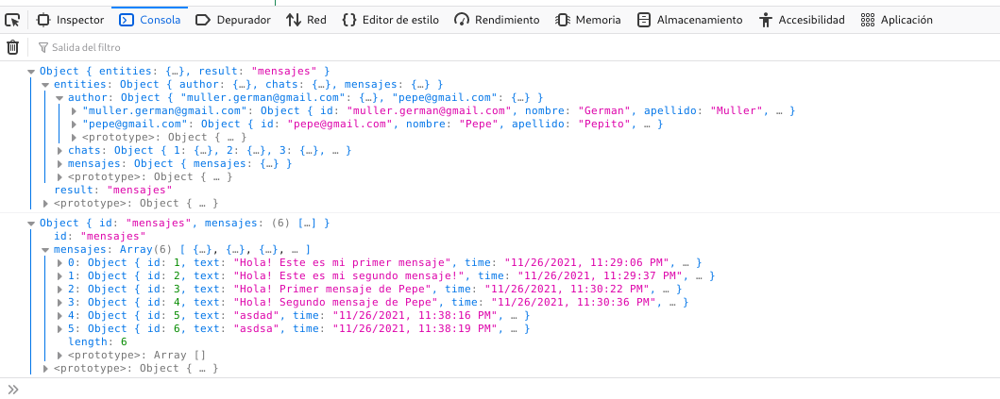
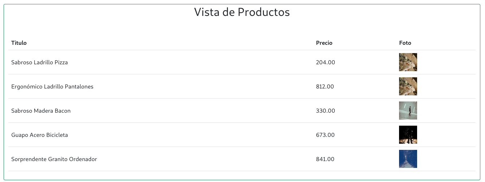

# Curso NodeJS - Entrega 10

## Enunciado General

### Consigna 1
Continuando con el desafío de la clase anterior, vamos a incorporar un mecanismo sencillo que permite loguear un cliente por su nombre, mediante un formulario de ingreso. Luego de que el usuario esté logueado, se mostrará sobre el contenido del sitio un cartel con el mensaje “Bienvenido” y el nombre de usuario. Este cartel tendrá un botón de deslogueo a su derecha.

Verificar que el cliente permanezca logueado en los reinicios de la página, mientras no expire el tiempo de inactividad de un minuto, que se recargará con cada request. En caso de alcanzarse ese tiempo, el próximo request de usuario nos llevará al formulario de login.

Al desloguearse, se mostrará una vista con el mensaje de 'Hasta luego' más el nombre y se retornará automáticamente, luego de dos segundos, a la vista de login de usuario.


### Detalles del entregable:
La solución entregada deberá persistir las sesiones de usuario en Mongo.
1. Verificar que en los reinicios del servidor, no se pierdan las sesiones activas de los clientes.
2. Mediante el cliente web de Mongo Atlas, revisar los id de sesión correspondientes a cada cliente y sus datos.
3. Borrar una sesión de cliente en la base y comprobar que en el próximo request al usuario se le presente la vista de login.
4. Fijar un tiempo de expiración de sesión de 10 minutos recargable con cada visita del cliente al sitio y verificar que si pasa ese tiempo de inactividad el cliente quede deslogueado.

## Configuración centralizada
Esta versión incluye un archivo de configuración __./config/config.js__ en el cual se detalla toda la configuración de las bases de datos.
```
// Configuracion General del Motor SQL
root = {
    client: 'mysql',
    connection: {
      host: '127.0.0.1',
      user: 'root'    
    }
}

// Configuracion para Productos
productos = {
    server: {
        client: 'mysql',
        connection: {
          host: '127.0.0.1',
          user: 'german',
          password: 'german',
          database: 'ecommerce'
        },
    },
    table: "productos",
}    

// Configuracion para Chats
chat_authors = {
    server: {
        client: 'sqlite3',
        connection: { filename: './db/ecommerce.sqlite' },
        useNullAsDefault: true
    },    
    table: "autores",
}

chat_msg = {
    server: {
        client: 'sqlite3',
        connection: { filename: './db/ecommerce.sqlite' },
        useNullAsDefault: true
    },    
    table: "mensages",
}


module.exports = {
    root,
    productos,  
    chat_authors,
    chat_msg
} ;
```


## Configuración de las Base de Datos
Se incluye un pequeño programa de JavaScript con Knex para la configuración y creación de tablas de cada DB.
```
node ./config/initdb.js [root_password_db]
```

Mediante este programa se configuran las DB necesarias para MariaDB/MySQL y SQLite3.
Este mismo script se encarga de crear el usuario de SQL y asignar los permisos correspondientes.

## Screenshots
### Control de Sesion
__Vista Login__


__Vista Principal__


__Vista Saludo__


### Mensajes/Chats
La aplicacion de chat se agrega al final, empleando un Spinner para simular el proceso de carga de la DB. Luego de 10 segundos, se actualiza el segmento correspondiente a la aplicacion de chat.

### Durante la inicialización del servidor:


### Luego se habilita la app de mensajería:


### Normalizacion/Desnormalizacion en el FrontEnd:


### Vista de Mock de Productos



## Información para pruebas
### Formato JSON
```
{
    "title": "Escuadra",
    "price": 123.45,
    "thumbnail": "https://cdn3.iconfinder.com/data/icons/education-209/64/ruler-triangle-stationary-school-512.png"
}
{
    "title": "Calculadora",
    "price": 234.56,
    "thumbnail": "https://cdn3.iconfinder.com/data/icons/education-209/64/calculator-math-tool-school-512.png"
}
{
    "title": "Globo Terraqueo",
    "price": 345.67,
    "thumbnail": "https://cdn3.iconfinder.com/data/icons/education-209/64/globe-earth-geograhy-planet-school-512.png"
}
```

### Script Curl
```
curl -d '{"title": "Escuadra", "price": 123.45, "thumbnail": "https://cdn3.iconfinder.com/data/icons/education-209/64/ruler-triangle-stationary-school-512.png"}' -H "Content-Type: application/json" -X POST http://localhost:8080/api/productos

curl -d '{"title": "Calculadora","price": 234.56,"thumbnail": "https://cdn3.iconfinder.com/data/icons/education-209/64/calculator-math-tool-school-512.png"}' -H "Content-Type: application/json" -X POST http://localhost:8080/api/productos

curl -d '{"title": "Globo Terraqueo","price": 345.67,"thumbnail": "https://cdn3.iconfinder.com/data/icons/education-209/64/globe-earth-geograhy-planet-school-512.png"}' -H "Content-Type: application/json" -X POST http://localhost:8080/api/productos
```