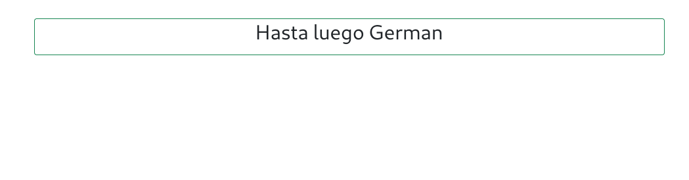

# Curso NodeJS - Entrega 11

## Enunciado General

### Consigna 1
Implementar sobre el entregable que venimos realizando un mecanismo de autenticación. Para ello:


Se incluirá una vista de registro, en donde se pidan email y contraseña. Estos datos se persistirán usando MongoDb, en una (nueva) colección de usuarios, cuidando que la contraseña quede encriptada (sugerencia: usar la librería bcrypt).


Una vista de login, donde se pida email y contraseña, y que realice la autenticación del lado del servidor a través de una estrategia de passport local. Cada una de las vistas (logueo - registro) deberá tener un botón para ser redirigido a la otra.

Una vez logueado el usuario, se lo redirigirá al inicio, el cual ahora mostrará también su email, y un botón para desolguearse. Además, se activará un espacio de sesión controlado por la sesión de passport. Esta estará activa por 10 minutos y en cada acceso se recargará este tiempo.


Agregar también vistas de error para login (credenciales no válidas) y registro (usuario ya registrado). El resto de la funciones, deben quedar tal cual estaban el proyecto original.


## Configuración centralizada
Esta versión incluye un archivo de configuración __./config/config.js__ en el cual se detalla toda la configuración de las bases de datos.
```
// Configuracion General del Motor SQL
root = {
    client: 'mysql',
    connection: {
      host: '127.0.0.1',
      user: 'root'    
    }
}

// Configuracion para Productos
productos = {
    server: {
        client: 'mysql',
        connection: {
          host: '127.0.0.1',
          user: 'german',
          password: 'german',
          database: 'ecommerce'
        },
    },
    table: "productos",
}    

// Configuracion para Chats
chat_authors = {
    server: {
        client: 'sqlite3',
        connection: { filename: './db/ecommerce.sqlite' },
        useNullAsDefault: true
    },    
    table: "autores",
}

chat_msg = {
    server: {
        client: 'sqlite3',
        connection: { filename: './db/ecommerce.sqlite' },
        useNullAsDefault: true
    },    
    table: "mensages",
}


module.exports = {
    root,
    productos,  
    chat_authors,
    chat_msg
} ;
```


## Configuración de las Base de Datos
Se incluye un pequeño programa de JavaScript con Knex para la configuración y creación de tablas de cada DB.
```
node ./config/initdb.js [root_password_db]
```

Mediante este programa se configuran las DB necesarias para MariaDB/MySQL y SQLite3.
Este mismo script se encarga de crear el usuario de SQL y asignar los permisos correspondientes.

## Screenshots
### Control de Sesion
__Vista Login__


__Vista Register__


__Vista Principal__


__Vista Saludo__



### Mensajes/Chats
La aplicacion de chat se agrega al final, empleando un Spinner para simular el proceso de carga de la DB. Luego de 10 segundos, se actualiza el segmento correspondiente a la aplicacion de chat.

### Durante la inicialización del servidor:


### Luego se habilita la app de mensajería:


### Normalizacion/Desnormalizacion en el FrontEnd:


### Vista de Mock de Productos


## Información para pruebas
### Formato JSON
```
{
    "title": "Escuadra",
    "price": 123.45,
    "thumbnail": "https://cdn3.iconfinder.com/data/icons/education-209/64/ruler-triangle-stationary-school-512.png"
}
{
    "title": "Calculadora",
    "price": 234.56,
    "thumbnail": "https://cdn3.iconfinder.com/data/icons/education-209/64/calculator-math-tool-school-512.png"
}
{
    "title": "Globo Terraqueo",
    "price": 345.67,
    "thumbnail": "https://cdn3.iconfinder.com/data/icons/education-209/64/globe-earth-geograhy-planet-school-512.png"
}
```

### Script Curl
```
curl -d '{"title": "Escuadra", "price": 123.45, "thumbnail": "https://cdn3.iconfinder.com/data/icons/education-209/64/ruler-triangle-stationary-school-512.png"}' -H "Content-Type: application/json" -X POST http://localhost:8080/api/productos

curl -d '{"title": "Calculadora","price": 234.56,"thumbnail": "https://cdn3.iconfinder.com/data/icons/education-209/64/calculator-math-tool-school-512.png"}' -H "Content-Type: application/json" -X POST http://localhost:8080/api/productos

curl -d '{"title": "Globo Terraqueo","price": 345.67,"thumbnail": "https://cdn3.iconfinder.com/data/icons/education-209/64/globe-earth-geograhy-planet-school-512.png"}' -H "Content-Type: application/json" -X POST http://localhost:8080/api/productos
```