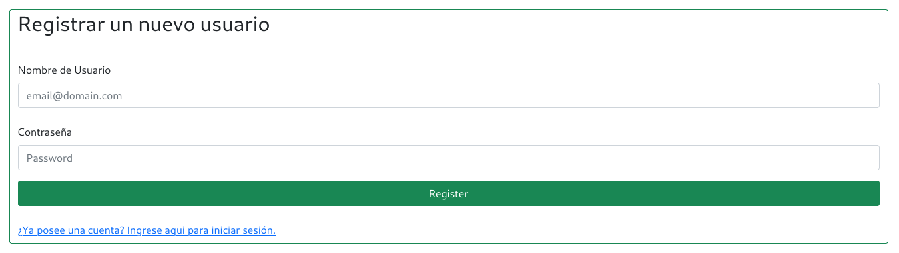
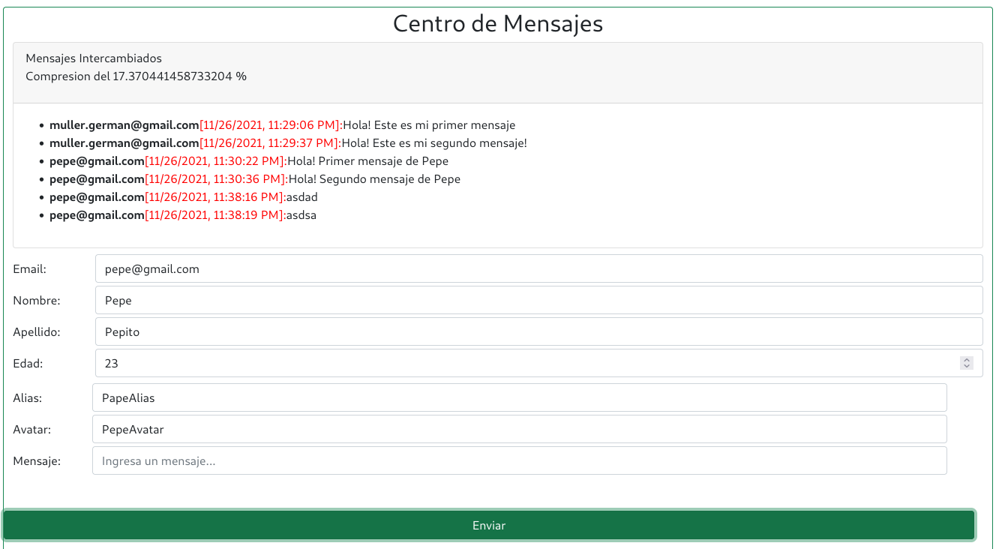

# Curso NodeJS - Entrega 12

## Enunciado General

### Consigna 1
Sobre el proyecto del último desafío entregable, mover todas las claves y credenciales utilizadas a un archivo .env, y cargarlo mediante la librería dotenv.

La única configuración que no va a ser manejada con esta librería va a ser el puerto de escucha del servidor. Éste deberá ser leído de los argumento pasados por línea de comando, usando alguna librería (minimist o yargs). En el caso de no pasar este parámetro por línea de comandos, conectar por defecto al
puerto 8080.

Observación: por el momento se puede dejar la elección de sesión y de persistencia explicitada en el código mismo. Más adelante haremos también parametrizable esta configuración.

### Consigna 2

Agregar una ruta '/info' que presente en una vista sencilla los siguientes datos:

* Argumentos de entrada - Path de ejecución
* Nombre de la plataforma (sistema operativo) - Process id
* Versión de node.js - Carpeta del proyecto
* Memoria total reservada (rss)

### Consigna 3

Agregar otra ruta '/api/randoms' que permita calcular un cantidad de números aleatorios en el rango del 1 al 1000 especificada por parámetros de consulta (query).Por ej: /randoms?cant=20000.

Si dicho parámetro no se ingresa, calcular 100.000.000 números. El dato devuelto al frontend será un objeto que contendrá como claves los números
random generados junto a la cantidad de veces que salió cada uno. Esta ruta no será bloqueante (utilizar el método fork de child process). Comprobar el no bloqueo con una cantidad de 500.000.000 de randoms.

Observación: utilizar routers y apis separadas para esta funcionalidad.

## Configuración de las Base de Datos
Se incluye un pequeño programa de JavaScript con Knex para la configuración y creación de tablas de cada DB.
```
node ./config/initdb.js [root_password_db]
```

Mediante este programa se configuran las DB necesarias para MariaDB/MySQL y SQLite3.
Este mismo script se encarga de crear el usuario de SQL y asignar los permisos correspondientes.

## Screenshots
### Control de Sesion
__Vista Login__


__Vista Register__


__Vista Principal__


__Vista Saludo__


### Mensajes/Chats
La aplicacion de chat se agrega al final, empleando un Spinner para simular el proceso de carga de la DB. Luego de 10 segundos, se actualiza el segmento correspondiente a la aplicacion de chat.

### Durante la inicialización del servidor:


### Luego se habilita la app de mensajería:


### Normalizacion/Desnormalizacion en el FrontEnd:


### Vista de Mock de Productos


### Vista de Información del sistema


## Información para pruebas
### Formato JSON
```
{
    "title": "Escuadra",
    "price": 123.45,
    "thumbnail": "https://cdn3.iconfinder.com/data/icons/education-209/64/ruler-triangle-stationary-school-512.png"
}
{
    "title": "Calculadora",
    "price": 234.56,
    "thumbnail": "https://cdn3.iconfinder.com/data/icons/education-209/64/calculator-math-tool-school-512.png"
}
{
    "title": "Globo Terraqueo",
    "price": 345.67,
    "thumbnail": "https://cdn3.iconfinder.com/data/icons/education-209/64/globe-earth-geograhy-planet-school-512.png"
}
```

### Script Curl
```
curl -d '{"title": "Escuadra", "price": 123.45, "thumbnail": "https://cdn3.iconfinder.com/data/icons/education-209/64/ruler-triangle-stationary-school-512.png"}' -H "Content-Type: application/json" -X POST http://localhost:8080/api/productos

curl -d '{"title": "Calculadora","price": 234.56,"thumbnail": "https://cdn3.iconfinder.com/data/icons/education-209/64/calculator-math-tool-school-512.png"}' -H "Content-Type: application/json" -X POST http://localhost:8080/api/productos

curl -d '{"title": "Globo Terraqueo","price": 345.67,"thumbnail": "https://cdn3.iconfinder.com/data/icons/education-209/64/globe-earth-geograhy-planet-school-512.png"}' -H "Content-Type: application/json" -X POST http://localhost:8080/api/productos
```