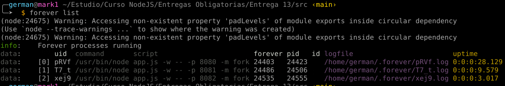
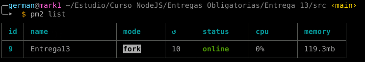
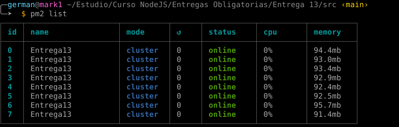
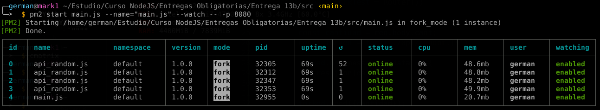
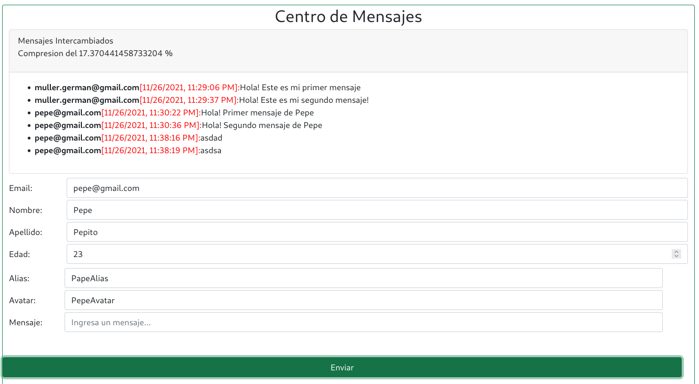
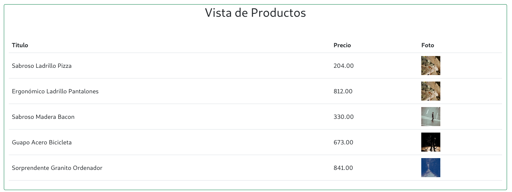
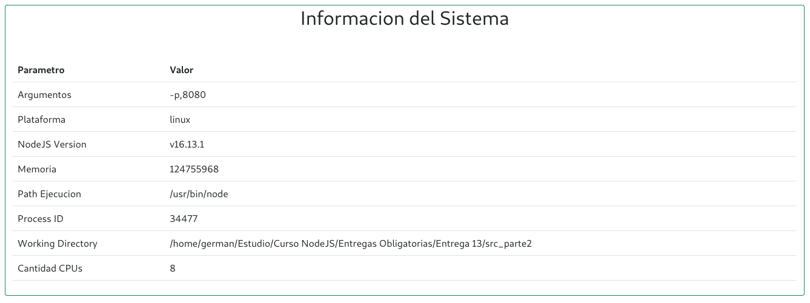

# Curso NodeJS - Entrega 13

## Enunciado General

### Consigna 1

Tomando con base el proyecto que vamos realizando, agregar un parámetro más en la ruta de comando que permita ejecutar al servidor en modo fork o cluster. Dicho parámetro será 'FORK' en el primer caso y 'CLUSTER' en el segundo, y de no pasarlo, el servidor iniciará en modo fork.

* Agregar en la vista info, el número de procesadores presentes en el servidor.
* Ejecutar el servidor (modos FORK y CLUSTER) con nodemon verificando el número de procesos tomados por node.
* Ejecutar el servidor (con los parámetros adecuados) utilizando Forever, verificando su correcta operación. Listar los procesos por Forever y por sistema operativo.
* Ejecutar el servidor (con los parámetros adecuados: modo FORK) utilizando PM2 en sus modos modo fork y cluster. Listar los procesos por PM2 y por sistema operativo.
* Tanto en Forever como en PM2 permitir el modo escucha, para que la actualización del código del servidor se vea reflejado inmediatamente en todos los procesos.
* Hacer pruebas de finalización de procesos fork y cluster en los casos que corresponda.


### Consigna 2

Configurar Nginx para balancear cargas de nuestro servidor de la siguiente manera:

Redirigir todas las consultas a /api/randoms a un cluster de servidores escuchando en el puerto 8081. El cluster será creado desde node utilizando el módulo nativo cluster.

El resto de las consultas, redirigirlas a un servidor individual escuchando en el puerto 8080.

Verificar que todo funcione correctamente.

Luego, modificar la configuración para que todas las consultas a /api/randoms sean redirigidas a un cluster de servidores gestionado desde nginx, repartiéndolas equitativamente entre 4 instancias escuchando en los puertos 8082, 8083, 8084 y 8085 respectivamente.

### Aspectos a incluir en el entregable

Incluir el archivo de configuración de nginx junto con el proyecto.

Incluir también un pequeño documento en donde se detallen los comandos que deben ejecutarse por línea de comandos y los argumentos que deben enviarse para levantar todas las instancias de servidores de modo que soporten la configuración detallada en los puntos
anteriores. Ejemplo:

* pm2 start ./miservidor.js -- --port=8080 --modo=fork
* pm2 start ./miservidor.js -- --port=8081 --modo=cluster
* pm2 start ./miservidor.js -- --port=8082 --modo=fork


## Configuración de las Base de Datos
Se incluye un pequeño programa de JavaScript con Knex para la configuración y creación de tablas de cada DB.
```
node ./config/initdb.js [root_password_db]
```

Mediante este programa se configuran las DB necesarias para MariaDB/MySQL y SQLite3.
Este mismo script se encarga de crear el usuario de SQL y asignar los permisos correspondientes.

## Configuracion de NGINX

A continuación se adjunta la configuración del servidor NGINX empleada para la "Consigna 2".

```
user www-data;
worker_processes auto;
pid /run/nginx.pid;
include /etc/nginx/modules-enabled/*.conf;

events {
	worker_connections 768;
}

http {


	sendfile on;
	tcp_nopush on;
	types_hash_max_size 2048;

	include /etc/nginx/mime.types;
	default_type application/octet-stream;

	ssl_prefer_server_ciphers on;

	access_log /var/log/nginx/access.log;
	error_log /var/log/nginx/error.log;

	gzip on;
	include /etc/nginx/conf.d/*.conf;
	include /etc/nginx/sites-enabled/*;


    upstream node_api {
        server 127.0.0.1:8081;
	server 127.0.0.1:8082;
	server 127.0.0.1:8083;
	server 127.0.0.1:8084;
    }

    upstream node_main {
	server 127.0.0.1:8080;
    }

    server {
        listen       80;
        server_name  localhost;

        location /api/randoms {
            proxy_pass http://node_api;
        }

        location / {
            proxy_pass http://node_main;
        }
        
        error_page   500 502 503 504  /50x.html;
        location = /50x.html {
            root   /usr/share/nginx/html;
        }

    }
}
```

En este caso se empleó la siguiente configuración para el establecimiento de los servers:

```
pm2 start api_random.js --name="api_random.js" -f --watch -- -p 8082
pm2 start api_random.js --name="api_random.js" -f --watch -- -p 8082
pm2 start api_random.js --name="api_random.js" -f --watch -- -p 8083
pm2 start api_random.js --name="api_random.js" -f --watch -- -p 8084
pm2 start main.js --name="main.js" --watch -- -p 8080
```

## Screenshots
### Control de Sesion
__Vista Login__


__Vista Register__


__Vista Principal__


__Vista Saludo__


### Resultados de Consigna 1

__Forever__




__PM2 Fork__



__PM2 Cluster__



### Resultados de Consigna 2




### Mensajes/Chats
La aplicacion de chat se agrega al final, empleando un Spinner para simular el proceso de carga de la DB. Luego de 10 segundos, se actualiza el segmento correspondiente a la aplicacion de chat.

### Durante la inicialización del servidor:


### Luego se habilita la app de mensajería:


### Normalizacion/Desnormalizacion en el FrontEnd:


### Vista de Mock de Productos


### Vista de Información del sistema



## Información para pruebas
### Formato JSON
```
{
    "title": "Escuadra",
    "price": 123.45,
    "thumbnail": "https://cdn3.iconfinder.com/data/icons/education-209/64/ruler-triangle-stationary-school-512.png"
}
{
    "title": "Calculadora",
    "price": 234.56,
    "thumbnail": "https://cdn3.iconfinder.com/data/icons/education-209/64/calculator-math-tool-school-512.png"
}
{
    "title": "Globo Terraqueo",
    "price": 345.67,
    "thumbnail": "https://cdn3.iconfinder.com/data/icons/education-209/64/globe-earth-geograhy-planet-school-512.png"
}
```

### Script Curl
```
curl -d '{"title": "Escuadra", "price": 123.45, "thumbnail": "https://cdn3.iconfinder.com/data/icons/education-209/64/ruler-triangle-stationary-school-512.png"}' -H "Content-Type: application/json" -X POST http://localhost:8080/api/productos

curl -d '{"title": "Calculadora","price": 234.56,"thumbnail": "https://cdn3.iconfinder.com/data/icons/education-209/64/calculator-math-tool-school-512.png"}' -H "Content-Type: application/json" -X POST http://localhost:8080/api/productos

curl -d '{"title": "Globo Terraqueo","price": 345.67,"thumbnail": "https://cdn3.iconfinder.com/data/icons/education-209/64/globe-earth-geograhy-planet-school-512.png"}' -H "Content-Type: application/json" -X POST http://localhost:8080/api/productos
```