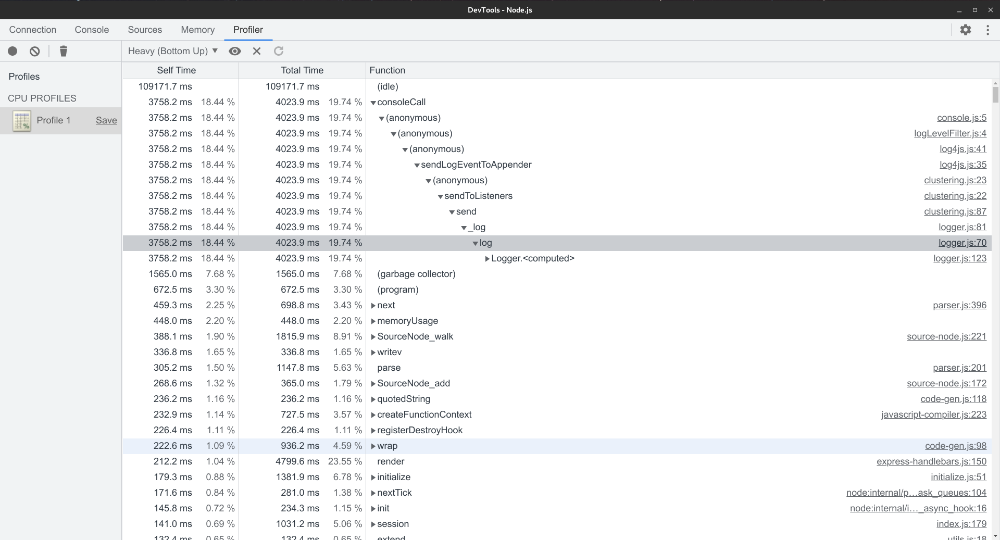
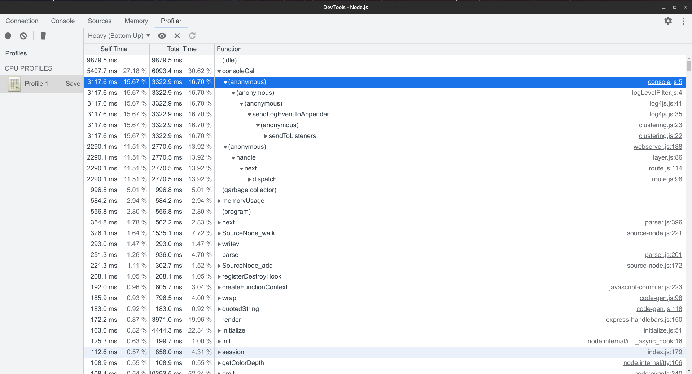
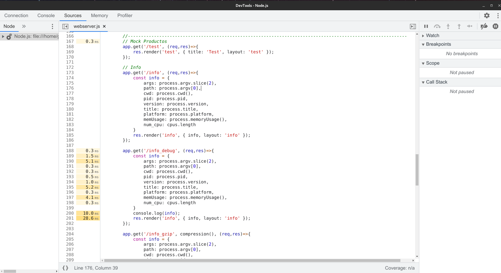
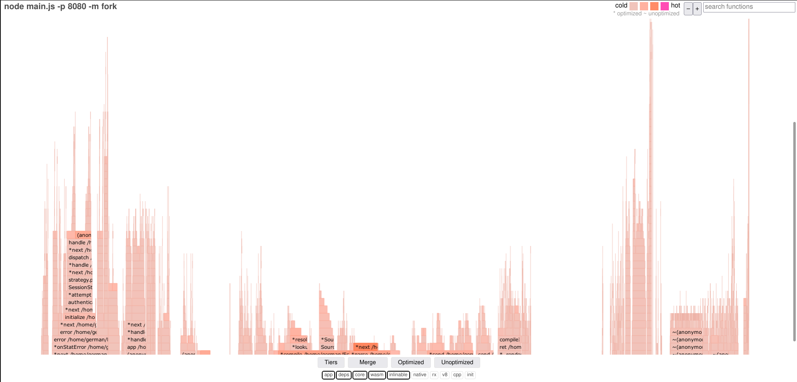
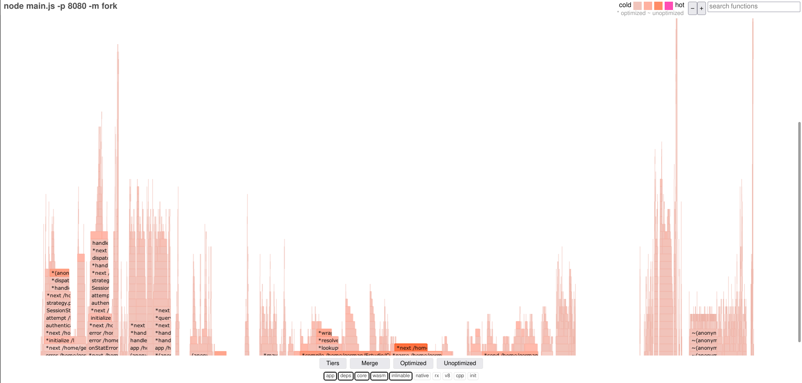
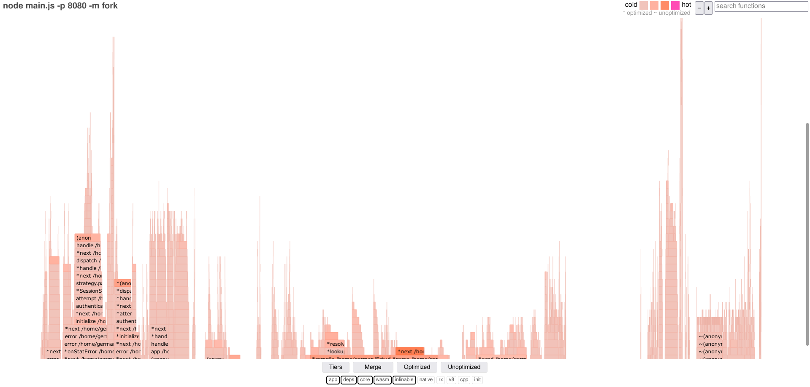
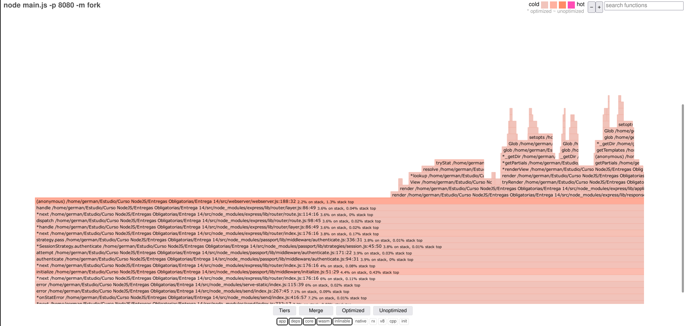
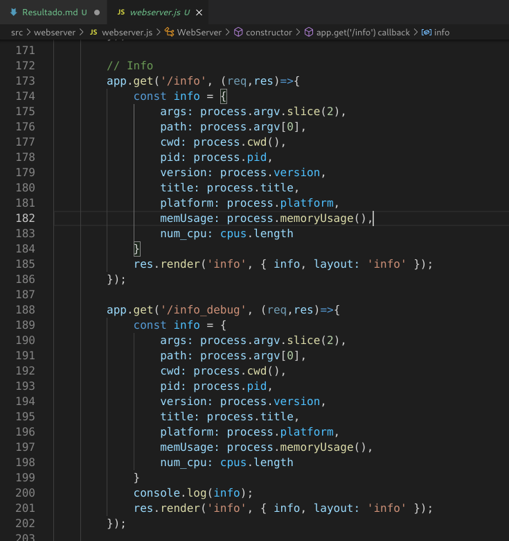

# Enunciados

## Consigna 1
Incorporar al proyecto de servidor de trabajo la compresión gzip. Verificar sobre la ruta /info con y sin compresión, la diferencia de cantidad de bytes devueltos en un caso y otro.

Luego implementar loggueo (con alguna librería vista en clase) que registre lo siguiente:

* Ruta y método de todas las peticiones recibidas por el servidor (info)
* Ruta y método de las peticiones a rutas inexistentes en el servidor (warning)
* Errores lanzados por las apis de mensajes y productos, únicamente (error)

Considerar el siguiente criterio:

* Loggear todos los niveles a consola (info, warning y error)
* Registrar sólo los logs de warning a un archivo llamada warn.log
* Enviar sólo los logs de error a un archivo llamada error.log

## Consigna 2

Luego, realizar el análisis completo de performance del servidor con el que venimos
trabajando.

Vamos a trabajar sobre la ruta '/info', en modo fork, agregando ó extrayendo un console.log de la información colectada antes de devolverla al cliente. Además desactivaremos el child_process de la ruta '/randoms'

Para ambas condiciones (con o sin console.log) en la ruta '/info' OBTENER:

El perfilamiento del servidor, realizando el test con --prof de node.js. Analizar los resultados obtenidos luego de procesarlos con --prof-process. Utilizaremos como test de carga Artillery en línea de comandos, emulando 50 conexiones concurrentes con 20 request por cada una. Extraer un reporte con los resultados en archivo de texto.

## Consigna 3
Luego utilizaremos Autocannon en línea de comandos, emulando 100 conexiones concurrentes realizadas en un tiempo de 20 segundos. Extraer un reporte con los resultados (puede ser un print screen de la consola)

El perfilamiento del servidor con el modo inspector de node.js --inspect. Revisar el tiempo de los procesos menos performantes sobre el archivo fuente de inspección.

## Consigna 4
El diagrama de flama con 0x, emulando la carga con Autocannon con los mismos parámetros anteriores.

-------------------------------------------------------------------------------

# Consigna 1
## Perfilamiento /info
```
mkdir perfilamiento_info
cd perfilamiento_info
artillery quick -c 50 -n 20 "http://localhost:8080/info" > artillery_info.txt
node --prof-process isolate-0x61b90c0-12093-v8.log > prof_info.txt
```

## Perfilamiento /info_debug
```
mkdir perfilamiento_info_debug
cd perfilamiento_info_debug
artillery quick -c 50 -n 20 "http://localhost:8080/info_debug" > artillery_info_debug.txt
node --prof-process isolate-0x61b90c0-12093-v8.log > prof_info_debug.txt
```

-------------------------------------------------------------------------------

# Consigna 2

## Ejecucion

Se instancia el server en modo __inspect__

```
node --inspect main.js -p 8080 -m fork 
```

Se realiza un benchmark empleando __autocannon__

```
node benchmark_individual.js http://localhost:8080/info
```

Luego se configura en Chrome un profiling especifico para cada ruta.

## Resultado

### Ruta /info
Se observa a continuación el resultado de los tiempos requeridos en la ruta "/info"



El archivo completo se adjunta a continuación:

* [ruta_info.cpuprofile](./Consulta_2/ruta_info.cpuprofile)

### Ruta /info_debug
Se observa a continuación el resultado de los tiempos requeridos en la ruta "/info_debug"



Luego, analizando el detalle de este analisis, se observa el consumo de "console.log".



El archivo completo se adjunta a continuación:

* [ruta_info_debug.cpuprofile](./Consulta_2/ruta_info_debug.cpuprofile)

-------------------------------------------------------------------------------

# Consigna 3

## Ejecucion Conjunta
Para ejecutar el server con el profiling de 0x:
```
0x main.js -p 8080 -m fork
```

Luego para disparar las pruebas en simultaneo de ambas rutas:
```
node benchmark.js
```

## Resultado
```
Running all benchmarks in parallel...
Running 20s test @ http://localhost:8080/info
100 connections

┌─────────┬────────┬────────┬─────────┬─────────┬───────────┬───────────┬─────────┐
│ Stat    │ 2.5%   │ 50%    │ 97.5%   │ 99%     │ Avg       │ Stdev     │ Max     │
├─────────┼────────┼────────┼─────────┼─────────┼───────────┼───────────┼─────────┤
│ Latency │ 385 ms │ 582 ms │ 1426 ms │ 1744 ms │ 670.06 ms │ 282.68 ms │ 2342 ms │
└─────────┴────────┴────────┴─────────┴─────────┴───────────┴───────────┴─────────┘
┌───────────┬─────┬──────┬────────┬────────┬────────┬────────┬────────┐
│ Stat      │ 1%  │ 2.5% │ 50%    │ 97.5%  │ Avg    │ Stdev  │ Min    │
├───────────┼─────┼──────┼────────┼────────┼────────┼────────┼────────┤
│ Req/Sec   │ 0   │ 0    │ 126    │ 268    │ 148.25 │ 65.34  │ 99     │
├───────────┼─────┼──────┼────────┼────────┼────────┼────────┼────────┤
│ Bytes/Sec │ 0 B │ 0 B  │ 397 kB │ 844 kB │ 467 kB │ 206 kB │ 312 kB │
└───────────┴─────┴──────┴────────┴────────┴────────┴────────┴────────┘

Req/Bytes counts sampled once per second.

3k requests in 20.07s, 9.33 MB read
Running 20s test @ http://localhost:8080/info_debug
100 connections

┌─────────┬────────┬────────┬─────────┬─────────┬───────────┬───────────┬─────────┐
│ Stat    │ 2.5%   │ 50%    │ 97.5%   │ 99%     │ Avg       │ Stdev     │ Max     │
├─────────┼────────┼────────┼─────────┼─────────┼───────────┼───────────┼─────────┤
│ Latency │ 387 ms │ 581 ms │ 1980 ms │ 2134 ms │ 681.09 ms │ 341.36 ms │ 2307 ms │
└─────────┴────────┴────────┴─────────┴─────────┴───────────┴───────────┴─────────┘
┌───────────┬─────┬──────┬────────┬────────┬────────┬────────┬────────┐
│ Stat      │ 1%  │ 2.5% │ 50%    │ 97.5%  │ Avg    │ Stdev  │ Min    │
├───────────┼─────┼──────┼────────┼────────┼────────┼────────┼────────┤
│ Req/Sec   │ 0   │ 0    │ 128    │ 300    │ 145    │ 71.69  │ 37     │
├───────────┼─────┼──────┼────────┼────────┼────────┼────────┼────────┤
│ Bytes/Sec │ 0 B │ 0 B  │ 403 kB │ 945 kB │ 456 kB │ 226 kB │ 116 kB │
└───────────┴─────┴──────┴────────┴────────┴────────┴────────┴────────┘

Req/Bytes counts sampled once per second.

3k requests in 20.06s, 9.13 MB read
```

Se adjunta a continuación el diagrama de flama asociado a dicho prueba.

[Diagrama de Flama](./Consigna_3/flamegraph.html)

El diagrama de flama obtenido es el siguiente: 



-------------------------------------------------------------------------------

# Consigna 4 - 0x solo ruta INFO

## Ejecucion
Para ejecutar el server con el profiling de 0x:
```
0x main.js -p 8080 -m fork
```

Luego para disparar las pruebas en simultaneo de ambas rutas:
```
node benchmark_individual.js http://localhost:8080/info
```

## Resultado
```
Running all benchmarks in parallel...
Running 20s test @ http://localhost:8080/info
100 connections

┌─────────┬────────┬────────┬────────┬────────┬───────────┬──────────┬────────┐
│ Stat    │ 2.5%   │ 50%    │ 97.5%  │ 99%    │ Avg       │ Stdev    │ Max    │
├─────────┼────────┼────────┼────────┼────────┼───────────┼──────────┼────────┤
│ Latency │ 198 ms │ 237 ms │ 400 ms │ 637 ms │ 257.14 ms │ 70.47 ms │ 875 ms │
└─────────┴────────┴────────┴────────┴────────┴───────────┴──────────┴────────┘
┌───────────┬────────┬────────┬─────────┬────────┬─────────┬────────┬────────┐
│ Stat      │ 1%     │ 2.5%   │ 50%     │ 97.5%  │ Avg     │ Stdev  │ Min    │
├───────────┼────────┼────────┼─────────┼────────┼─────────┼────────┼────────┤
│ Req/Sec   │ 136    │ 136    │ 400     │ 475    │ 385.85  │ 80.19  │ 136    │
├───────────┼────────┼────────┼─────────┼────────┼─────────┼────────┼────────┤
│ Bytes/Sec │ 428 kB │ 428 kB │ 1.26 MB │ 1.5 MB │ 1.21 MB │ 252 kB │ 428 kB │
└───────────┴────────┴────────┴─────────┴────────┴─────────┴────────┴────────┘

Req/Bytes counts sampled once per second.

8k requests in 20.05s, 24.3 MB read
```

El diagrama de flama de resultado se obtiene en el siguiente archivo:
```
Flame_Result_INFO
```

Se adjunta a continuación el diagrama de flama asociado a dicho prueba.

[Diagrama de Flama](./Consigna_4/flamegraph.html)

El diagrama de flama obtenido es el siguiente: 



-------------------------------------------------------------------------------

# Consigna 5 - 0x solo ruta INFO_DEBUG

## Ejecucion
Para ejecutar el server con el profiling de 0x:
```
0x main.js -p 8080 -m fork
```

Luego para disparar las pruebas en simultaneo de ambas rutas:
```
node benchmark_individual.js http://localhost:8080/info_debug
```

## Resultado
```
Running all benchmarks in parallel...
Running 20s test @ http://localhost:8080/info_debug
100 connections

┌─────────┬────────┬────────┬────────┬────────┬──────────┬──────────┬────────┐
│ Stat    │ 2.5%   │ 50%    │ 97.5%  │ 99%    │ Avg      │ Stdev    │ Max    │
├─────────┼────────┼────────┼────────┼────────┼──────────┼──────────┼────────┤
│ Latency │ 204 ms │ 247 ms │ 404 ms │ 663 ms │ 269.5 ms │ 74.26 ms │ 908 ms │
└─────────┴────────┴────────┴────────┴────────┴──────────┴──────────┴────────┘
┌───────────┬────────┬────────┬─────────┬─────────┬─────────┬────────┬────────┐
│ Stat      │ 1%     │ 2.5%   │ 50%     │ 97.5%   │ Avg     │ Stdev  │ Min    │
├───────────┼────────┼────────┼─────────┼─────────┼─────────┼────────┼────────┤
│ Req/Sec   │ 120    │ 120    │ 387     │ 459     │ 368.3   │ 77.59  │ 120    │
├───────────┼────────┼────────┼─────────┼─────────┼─────────┼────────┼────────┤
│ Bytes/Sec │ 378 kB │ 378 kB │ 1.22 MB │ 1.44 MB │ 1.16 MB │ 244 kB │ 378 kB │
└───────────┴────────┴────────┴─────────┴─────────┴─────────┴────────┴────────┘

Req/Bytes counts sampled once per second.

7k requests in 20.05s, 23.2 MB read
```

El diagrama de flama de resultado se obtiene en el siguiente archivo:

```
Flame_Result_INFO_Debug
```

Se adjunta a continuación el diagrama de flama asociado a dicho prueba.

[Diagrama de Flama](./Consigna_5/flamegraph.html)

El diagrama de flama obtenido es el siguiente: 



-------------------------------------------------------------------------------

# Conclusiones

En base al análisis de perfilamiento se observa que la ruta "/info_debug" consume una mayor cantidad de recursos como consecuencia de la operación "console.log" que se emplea para el debug del proceso. 






El documento completo de perfilamiento se encuentra en el siguiente PDF:

[Perfilamiento](./Perfilamiento/Resultado.pdf)