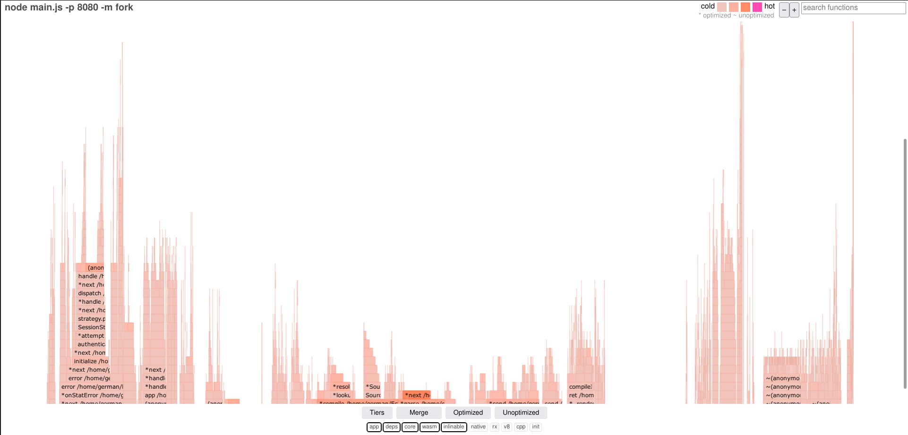
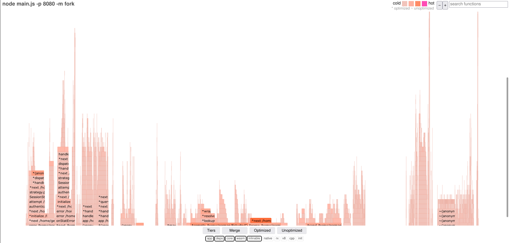
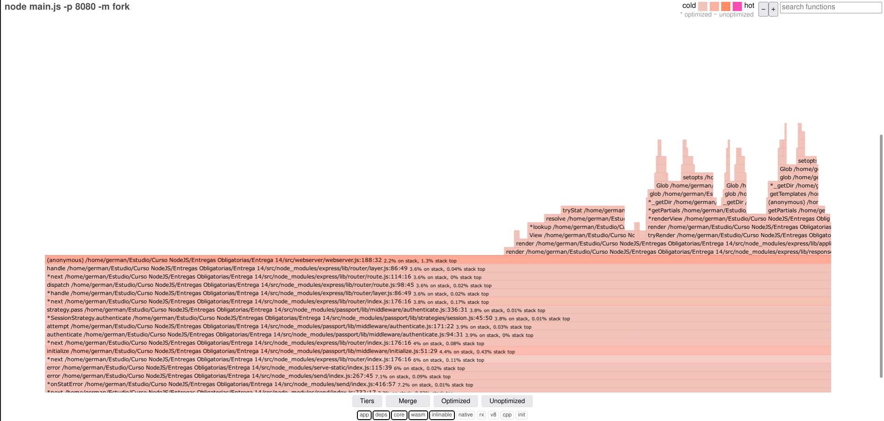

# Curso NodeJS - Entrega 14

<!-- vscode-markdown-toc -->
* 1. [Enunciado General](#EnunciadoGeneral)
	* 1.1. [Consigna 1](#Consigna1)
	* 1.2. [Consigna 2](#Consigna2)
	* 1.3. [Consigna 3](#Consigna3)
	* 1.4. [Consigna 4](#Consigna4)
* 2. [Configuración de las Base de Datos](#ConfiguracindelasBasedeDatos)
* 3. [Configuracion de NGINX](#ConfiguraciondeNGINX)
* 4. [Screenshots](#Screenshots)
	* 4.1. [Control de Sesion](#ControldeSesion)
	* 4.2. [Resultados de Consigna 1](#ResultadosdeConsigna1)
	* 4.3. [Resultados de Consigna 2](#ResultadosdeConsigna2)
	* 4.4. [Mensajes/Chats](#MensajesChats)
	* 4.5. [Durante la inicialización del servidor:](#Durantelainicializacindelservidor:)
	* 4.6. [Luego se habilita la app de mensajería:](#Luegosehabilitalaappdemensajera:)
	* 4.7. [Normalizacion/Desnormalizacion en el FrontEnd:](#NormalizacionDesnormalizacionenelFrontEnd:)
	* 4.8. [Vista de Mock de Productos](#VistadeMockdeProductos)
	* 4.9. [Vista de Información del sistema](#VistadeInformacindelsistema)
* 5. [Información para pruebas](#Informacinparapruebas)
	* 5.1. [Formato JSON](#FormatoJSON)
	* 5.2. [Script Curl](#ScriptCurl)
* 6. [Consigna 1](#Consigna1-1)
	* 6.1. [Perfilamiento /info](#Perfilamientoinfo)
	* 6.2. [Perfilamiento /info_debug](#Perfilamientoinfo_debug)
* 7. [Consigna 2](#Consigna2-1)
	* 7.1. [Ejecucion](#Ejecucion)
	* 7.2. [Resultado](#Resultado)
		* 7.2.1. [Ruta /info](#Rutainfo)
		* 7.2.2. [Ruta /info_debug](#Rutainfo_debug)
* 8. [Consigna 3](#Consigna3-1)
	* 8.1. [Ejecucion Conjunta](#EjecucionConjunta)
	* 8.2. [Resultado](#Resultado-1)
* 9. [Consigna 4 - 0x solo ruta INFO](#Consigna4-0xsolorutaINFO)
	* 9.1. [Ejecucion](#Ejecucion-1)
	* 9.2. [Resultado](#Resultado-1)
* 10. [Consigna 5 - 0x solo ruta INFO_DEBUG](#Consigna5-0xsolorutaINFO_DEBUG)
	* 10.1. [Ejecucion](#Ejecucion-1)
	* 10.2. [Resultado](#Resultado-1)
* 11. [Conclusiones](#Conclusiones)

<!-- vscode-markdown-toc-config
	numbering=true
	autoSave=true
	/vscode-markdown-toc-config -->
<!-- /vscode-markdown-toc -->

##  1. <a name='EnunciadoGeneral'></a>Enunciado General

###  1.1. <a name='Consigna1'></a>Consigna 1
Incorporar al proyecto de servidor de trabajo la compresión gzip. Verificar sobre la ruta /info con y sin compresión, la diferencia de cantidad de bytes devueltos en un caso y otro.

Luego implementar loggueo (con alguna librería vista en clase) que registre lo siguiente:

* Ruta y método de todas las peticiones recibidas por el servidor (info)
* Ruta y método de las peticiones a rutas inexistentes en el servidor (warning)
* Errores lanzados por las apis de mensajes y productos, únicamente (error)

Considerar el siguiente criterio:

* Loggear todos los niveles a consola (info, warning y error)
* Registrar sólo los logs de warning a un archivo llamada warn.log
* Enviar sólo los logs de error a un archivo llamada error.log

###  1.2. <a name='Consigna2'></a>Consigna 2

Luego, realizar el análisis completo de performance del servidor con el que venimos
trabajando.

Vamos a trabajar sobre la ruta '/info', en modo fork, agregando ó extrayendo un console.log de la información colectada antes de devolverla al cliente. Además desactivaremos el child_process de la ruta '/randoms'

Para ambas condiciones (con o sin console.log) en la ruta '/info' OBTENER:

El perfilamiento del servidor, realizando el test con --prof de node.js. Analizar los resultados obtenidos luego de procesarlos con --prof-process. Utilizaremos como test de carga Artillery en línea de comandos, emulando 50 conexiones concurrentes con 20 request por cada una. Extraer un reporte con los resultados en archivo de texto.

###  1.3. <a name='Consigna3'></a>Consigna 3
Luego utilizaremos Autocannon en línea de comandos, emulando 100 conexiones concurrentes realizadas en un tiempo de 20 segundos. Extraer un reporte con los resultados (puede ser un print screen de la consola)

El perfilamiento del servidor con el modo inspector de node.js --inspect. Revisar el tiempo de los procesos menos performantes sobre el archivo fuente de inspección.

###  1.4. <a name='Consigna4'></a>Consigna 4
El diagrama de flama con 0x, emulando la carga con Autocannon con los mismos parámetros anteriores.

##  2. <a name='ConfiguracindelasBasedeDatos'></a>Configuración de las Base de Datos
Se incluye un pequeño programa de JavaScript con Knex para la configuración y creación de tablas de cada DB.
```
node ./config/initdb.js [root_password_db]
```

Mediante este programa se configuran las DB necesarias para MariaDB/MySQL y SQLite3.
Este mismo script se encarga de crear el usuario de SQL y asignar los permisos correspondientes.

##  3. <a name='ConfiguraciondeNGINX'></a>Configuracion de NGINX

A continuación se adjunta la configuración del servidor NGINX empleada para la "Consigna 2".

```
user www-data;
worker_processes auto;
pid /run/nginx.pid;
include /etc/nginx/modules-enabled/*.conf;

events {
	worker_connections 768;
}

http {


	sendfile on;
	tcp_nopush on;
	types_hash_max_size 2048;

	include /etc/nginx/mime.types;
	default_type application/octet-stream;

	ssl_prefer_server_ciphers on;

	access_log /var/log/nginx/access.log;
	error_log /var/log/nginx/error.log;

	gzip on;
	include /etc/nginx/conf.d/*.conf;
	include /etc/nginx/sites-enabled/*;


    upstream node_api {
        server 127.0.0.1:8081;
	server 127.0.0.1:8082;
	server 127.0.0.1:8083;
	server 127.0.0.1:8084;
    }

    upstream node_main {
	server 127.0.0.1:8080;
    }

    server {
        listen       80;
        server_name  localhost;

        location /api/randoms {
            proxy_pass http://node_api;
        }

        location / {
            proxy_pass http://node_main;
        }
        
        error_page   500 502 503 504  /50x.html;
        location = /50x.html {
            root   /usr/share/nginx/html;
        }

    }
}
```

En este caso se empleó la siguiente configuración para el establecimiento de los servers:

```
pm2 start api_random.js --name="api_random.js" -f --watch -- -p 8082
pm2 start api_random.js --name="api_random.js" -f --watch -- -p 8082
pm2 start api_random.js --name="api_random.js" -f --watch -- -p 8083
pm2 start api_random.js --name="api_random.js" -f --watch -- -p 8084
pm2 start main.js --name="main.js" --watch -- -p 8080
```

##  4. <a name='Screenshots'></a>Screenshots
###  4.1. <a name='ControldeSesion'></a>Control de Sesion
__Vista Login__


__Vista Register__


__Vista Principal__


__Vista Saludo__


###  4.2. <a name='ResultadosdeConsigna1'></a>Resultados de Consigna 1

__Forever__


__PM2 Fork__


__PM2 Cluster__


###  4.3. <a name='ResultadosdeConsigna2'></a>Resultados de Consigna 2


###  4.4. <a name='MensajesChats'></a>Mensajes/Chats
La aplicacion de chat se agrega al final, empleando un Spinner para simular el proceso de carga de la DB. Luego de 10 segundos, se actualiza el segmento correspondiente a la aplicacion de chat.

###  4.5. <a name='Durantelainicializacindelservidor:'></a>Durante la inicialización del servidor:


###  4.6. <a name='Luegosehabilitalaappdemensajera:'></a>Luego se habilita la app de mensajería:


###  4.7. <a name='NormalizacionDesnormalizacionenelFrontEnd:'></a>Normalizacion/Desnormalizacion en el FrontEnd:


###  4.8. <a name='VistadeMockdeProductos'></a>Vista de Mock de Productos


###  4.9. <a name='VistadeInformacindelsistema'></a>Vista de Información del sistema


##  5. <a name='Informacinparapruebas'></a>Información para pruebas
###  5.1. <a name='FormatoJSON'></a>Formato JSON
```
{
    "title": "Escuadra",
    "price": 123.45,
    "thumbnail": "https://cdn3.iconfinder.com/data/icons/education-209/64/ruler-triangle-stationary-school-512.png"
}
{
    "title": "Calculadora",
    "price": 234.56,
    "thumbnail": "https://cdn3.iconfinder.com/data/icons/education-209/64/calculator-math-tool-school-512.png"
}
{
    "title": "Globo Terraqueo",
    "price": 345.67,
    "thumbnail": "https://cdn3.iconfinder.com/data/icons/education-209/64/globe-earth-geograhy-planet-school-512.png"
}
```

###  5.2. <a name='ScriptCurl'></a>Script Curl
```
curl -d '{"title": "Escuadra", "price": 123.45, "thumbnail": "https://cdn3.iconfinder.com/data/icons/education-209/64/ruler-triangle-stationary-school-512.png"}' -H "Content-Type: application/json" -X POST http://localhost:8080/api/productos

curl -d '{"title": "Calculadora","price": 234.56,"thumbnail": "https://cdn3.iconfinder.com/data/icons/education-209/64/calculator-math-tool-school-512.png"}' -H "Content-Type: application/json" -X POST http://localhost:8080/api/productos

curl -d '{"title": "Globo Terraqueo","price": 345.67,"thumbnail": "https://cdn3.iconfinder.com/data/icons/education-209/64/globe-earth-geograhy-planet-school-512.png"}' -H "Content-Type: application/json" -X POST http://localhost:8080/api/productos
```

-------------------------------------------------------------------------------------------------------------------------------------------

# Resultado

##  6. <a name='Consigna1-1'></a>Consigna 1
###  6.1. <a name='Perfilamientoinfo'></a>Perfilamiento /info
```
mkdir perfilamiento_info
cd perfilamiento_info
artillery quick -c 50 -n 20 "http://localhost:8080/info" > artillery_info.txt
node --prof-process isolate-0x61b90c0-12093-v8.log > prof_info.txt
```

###  6.2. <a name='Perfilamientoinfo_debug'></a>Perfilamiento /info_debug
```
mkdir perfilamiento_info_debug
cd perfilamiento_info_debug
artillery quick -c 50 -n 20 "http://localhost:8080/info_debug" > artillery_info_debug.txt
node --prof-process isolate-0x61b90c0-12093-v8.log > prof_info_debug.txt
```

El resultado de este procesamiento se observa a continuación, observando que la ruta "/info_debug" requiere una mayor cantidad de ticks.


-------------------------------------------------------------------------------

##  7. <a name='Consigna2-1'></a>Consigna 2

###  7.1. <a name='Ejecucion'></a>Ejecucion

Se instancia el server en modo __inspect__

```
node --inspect main.js -p 8080 -m fork 
```

Se realiza un benchmark empleando __autocannon__

```
node benchmark_individual.js http://localhost:8080/info
```

Luego se configura en Chrome un profiling especifico para cada ruta.

###  7.2. <a name='Resultado'></a>Resultado

####  7.2.1. <a name='Rutainfo'></a>Ruta /info
Se observa a continuación el resultado de los tiempos requeridos en la ruta "/info"


El archivo completo se adjunta a continuación:

* [ruta_info.cpuprofile](./Perfilamiento/Consulta_2/ruta_info.cpuprofile)

####  7.2.2. <a name='Rutainfo_debug'></a>Ruta /info_debug
Se observa a continuación el resultado de los tiempos requeridos en la ruta "/info_debug"


Luego, analizando el detalle de este analisis, se observa el consumo de "console.log".


El archivo completo se adjunta a continuación:

* [ruta_info_debug.cpuprofile](./Perfilamiento/Consulta_2/ruta_info_debug.cpuprofile)

-------------------------------------------------------------------------------

##  8. <a name='Consigna3-1'></a>Consigna 3

###  8.1. <a name='EjecucionConjunta'></a>Ejecucion Conjunta
Para ejecutar el server con el profiling de 0x:
```
0x main.js -p 8080 -m fork
```

Luego para disparar las pruebas en simultaneo de ambas rutas:
```
node benchmark.js
```

###  8.2. <a name='Resultado-1'></a>Resultado
```
Running all benchmarks in parallel...
Running 20s test @ http://localhost:8080/info
100 connections

┌─────────┬────────┬────────┬─────────┬─────────┬───────────┬───────────┬─────────┐
│ Stat    │ 2.5%   │ 50%    │ 97.5%   │ 99%     │ Avg       │ Stdev     │ Max     │
├─────────┼────────┼────────┼─────────┼─────────┼───────────┼───────────┼─────────┤
│ Latency │ 385 ms │ 582 ms │ 1426 ms │ 1744 ms │ 670.06 ms │ 282.68 ms │ 2342 ms │
└─────────┴────────┴────────┴─────────┴─────────┴───────────┴───────────┴─────────┘
┌───────────┬─────┬──────┬────────┬────────┬────────┬────────┬────────┐
│ Stat      │ 1%  │ 2.5% │ 50%    │ 97.5%  │ Avg    │ Stdev  │ Min    │
├───────────┼─────┼──────┼────────┼────────┼────────┼────────┼────────┤
│ Req/Sec   │ 0   │ 0    │ 126    │ 268    │ 148.25 │ 65.34  │ 99     │
├───────────┼─────┼──────┼────────┼────────┼────────┼────────┼────────┤
│ Bytes/Sec │ 0 B │ 0 B  │ 397 kB │ 844 kB │ 467 kB │ 206 kB │ 312 kB │
└───────────┴─────┴──────┴────────┴────────┴────────┴────────┴────────┘

Req/Bytes counts sampled once per second.

3k requests in 20.07s, 9.33 MB read
Running 20s test @ http://localhost:8080/info_debug
100 connections

┌─────────┬────────┬────────┬─────────┬─────────┬───────────┬───────────┬─────────┐
│ Stat    │ 2.5%   │ 50%    │ 97.5%   │ 99%     │ Avg       │ Stdev     │ Max     │
├─────────┼────────┼────────┼─────────┼─────────┼───────────┼───────────┼─────────┤
│ Latency │ 387 ms │ 581 ms │ 1980 ms │ 2134 ms │ 681.09 ms │ 341.36 ms │ 2307 ms │
└─────────┴────────┴────────┴─────────┴─────────┴───────────┴───────────┴─────────┘
┌───────────┬─────┬──────┬────────┬────────┬────────┬────────┬────────┐
│ Stat      │ 1%  │ 2.5% │ 50%    │ 97.5%  │ Avg    │ Stdev  │ Min    │
├───────────┼─────┼──────┼────────┼────────┼────────┼────────┼────────┤
│ Req/Sec   │ 0   │ 0    │ 128    │ 300    │ 145    │ 71.69  │ 37     │
├───────────┼─────┼──────┼────────┼────────┼────────┼────────┼────────┤
│ Bytes/Sec │ 0 B │ 0 B  │ 403 kB │ 945 kB │ 456 kB │ 226 kB │ 116 kB │
└───────────┴─────┴──────┴────────┴────────┴────────┴────────┴────────┘

Req/Bytes counts sampled once per second.

3k requests in 20.06s, 9.13 MB read
```

Se adjunta a continuación el diagrama de flama asociado a dicho prueba.

[Diagrama de Flama](./Perfilamiento/Consigna_3/flamegraph.html)

El diagrama de flama obtenido es el siguiente: 



-------------------------------------------------------------------------------

##  9. <a name='Consigna4-0xsolorutaINFO'></a>Consigna 4 - 0x solo ruta INFO

###  9.1. <a name='Ejecucion-1'></a>Ejecucion
Para ejecutar el server con el profiling de 0x:
```
0x main.js -p 8080 -m fork
```

Luego para disparar las pruebas en simultaneo de ambas rutas:
```
node benchmark_individual.js http://localhost:8080/info
```

###  9.2. <a name='Resultado-1'></a>Resultado
```
Running all benchmarks in parallel...
Running 20s test @ http://localhost:8080/info
100 connections

┌─────────┬────────┬────────┬────────┬────────┬───────────┬──────────┬────────┐
│ Stat    │ 2.5%   │ 50%    │ 97.5%  │ 99%    │ Avg       │ Stdev    │ Max    │
├─────────┼────────┼────────┼────────┼────────┼───────────┼──────────┼────────┤
│ Latency │ 198 ms │ 237 ms │ 400 ms │ 637 ms │ 257.14 ms │ 70.47 ms │ 875 ms │
└─────────┴────────┴────────┴────────┴────────┴───────────┴──────────┴────────┘
┌───────────┬────────┬────────┬─────────┬────────┬─────────┬────────┬────────┐
│ Stat      │ 1%     │ 2.5%   │ 50%     │ 97.5%  │ Avg     │ Stdev  │ Min    │
├───────────┼────────┼────────┼─────────┼────────┼─────────┼────────┼────────┤
│ Req/Sec   │ 136    │ 136    │ 400     │ 475    │ 385.85  │ 80.19  │ 136    │
├───────────┼────────┼────────┼─────────┼────────┼─────────┼────────┼────────┤
│ Bytes/Sec │ 428 kB │ 428 kB │ 1.26 MB │ 1.5 MB │ 1.21 MB │ 252 kB │ 428 kB │
└───────────┴────────┴────────┴─────────┴────────┴─────────┴────────┴────────┘

Req/Bytes counts sampled once per second.

8k requests in 20.05s, 24.3 MB read
```

El diagrama de flama de resultado se obtiene en el siguiente archivo:
```
Flame_Result_INFO
```

Se adjunta a continuación el diagrama de flama asociado a dicho prueba.

[Diagrama de Flama](./Perfilamiento/Consigna_4/flamegraph.html)

El diagrama de flama obtenido es el siguiente: 



-------------------------------------------------------------------------------

##  10. <a name='Consigna5-0xsolorutaINFO_DEBUG'></a>Consigna 5 - 0x solo ruta INFO_DEBUG

###  10.1. <a name='Ejecucion-1'></a>Ejecucion
Para ejecutar el server con el profiling de 0x:
```
0x main.js -p 8080 -m fork
```

Luego para disparar las pruebas en simultaneo de ambas rutas:
```
node benchmark_individual.js http://localhost:8080/info_debug
```

###  10.2. <a name='Resultado-1'></a>Resultado
```
Running all benchmarks in parallel...
Running 20s test @ http://localhost:8080/info_debug
100 connections

┌─────────┬────────┬────────┬────────┬────────┬──────────┬──────────┬────────┐
│ Stat    │ 2.5%   │ 50%    │ 97.5%  │ 99%    │ Avg      │ Stdev    │ Max    │
├─────────┼────────┼────────┼────────┼────────┼──────────┼──────────┼────────┤
│ Latency │ 204 ms │ 247 ms │ 404 ms │ 663 ms │ 269.5 ms │ 74.26 ms │ 908 ms │
└─────────┴────────┴────────┴────────┴────────┴──────────┴──────────┴────────┘
┌───────────┬────────┬────────┬─────────┬─────────┬─────────┬────────┬────────┐
│ Stat      │ 1%     │ 2.5%   │ 50%     │ 97.5%   │ Avg     │ Stdev  │ Min    │
├───────────┼────────┼────────┼─────────┼─────────┼─────────┼────────┼────────┤
│ Req/Sec   │ 120    │ 120    │ 387     │ 459     │ 368.3   │ 77.59  │ 120    │
├───────────┼────────┼────────┼─────────┼─────────┼─────────┼────────┼────────┤
│ Bytes/Sec │ 378 kB │ 378 kB │ 1.22 MB │ 1.44 MB │ 1.16 MB │ 244 kB │ 378 kB │
└───────────┴────────┴────────┴─────────┴─────────┴─────────┴────────┴────────┘

Req/Bytes counts sampled once per second.

7k requests in 20.05s, 23.2 MB read
```

El diagrama de flama de resultado se obtiene en el siguiente archivo:

```
Flame_Result_INFO_Debug
```

Se adjunta a continuación el diagrama de flama asociado a dicho prueba.

[Diagrama de Flama](./Perfilamiento/Consigna_5/flamegraph.html)

El diagrama de flama obtenido es el siguiente: 


-------------------------------------------------------------------------------

##  11. <a name='Conclusiones'></a>Conclusiones

En base al análisis de perfilamiento se observa que la ruta "/info_debug" consume una mayor cantidad de recursos como consecuencia de la operación "console.log" que se emplea para el debug del proceso. 




