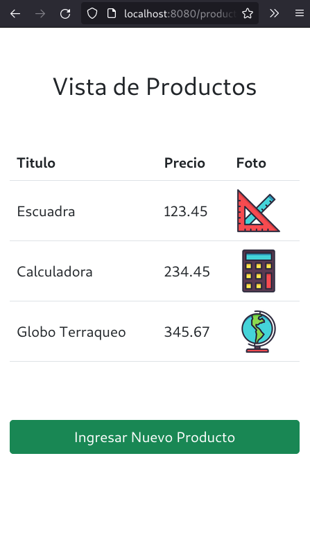

# Curso NodeJS - Entrega 5
# Versión PUG


## Enunciado General

Utilizando la misma API de productos del proyecto entregable de la clase
anterior, construir un web server (no REST) que incorpore:

1. Un formulario de carga de productos en la ruta raíz (configurar la ruta
'/productos' para recibir el POST, y redirigir al mismo formulario).

2. Una vista de los productos cargados (utilizando plantillas de
handlebars) en la ruta GET '/productos'.

3. Ambas páginas contarán con un botón que redirija a la otra.


## Implementaciones
1. Manteniendo la misma funcionalidad reemplazar el motor de plantillas
handlebars por pug.

2. Manteniendo la misma funcionalidad reemplazar el motor de plantillas
handlebars por ejs.

3. Por escrito, indicar cuál de los tres motores de plantillas prefieres para tu
proyecto y por qué.

## Screenshots





## Información para pruebas
### Formato JSON
```
{
    "title": "Escuadra",
    "price": 123.45,
    "thumbnail": "https://cdn3.iconfinder.com/data/icons/education-209/64/ruler-triangle-stationary-school-512.png"
}
{
    "title": "Calculadora",
    "price": 234.56,
    "thumbnail": "https://cdn3.iconfinder.com/data/icons/education-209/64/calculator-math-tool-school-512.png"
}
{
    "title": "Globo Terraqueo",
    "price": 345.67,
    "thumbnail": "https://cdn3.iconfinder.com/data/icons/education-209/64/globe-earth-geograhy-planet-school-512.png"
}
```

### Script Curl
```
curl -d '{"title": "Escuadra", "price": 123.45, "thumbnail": "https://cdn3.iconfinder.com/data/icons/education-209/64/ruler-triangle-stationary-school-512.png"}' -H "Content-Type: application/json" -X POST http://localhost:8080/api/productos

curl -d '{"title": "Calculadora","price": 234.56,"thumbnail": "https://cdn3.iconfinder.com/data/icons/education-209/64/calculator-math-tool-school-512.png"}' -H "Content-Type: application/json" -X POST http://localhost:8080/api/productos

curl -d '{"title": "Globo Terraqueo","price": 345.67,"thumbnail": "https://cdn3.iconfinder.com/data/icons/education-209/64/globe-earth-geograhy-planet-school-512.png"}' -H "Content-Type: application/json" -X POST http://localhost:8080/api/productos
```