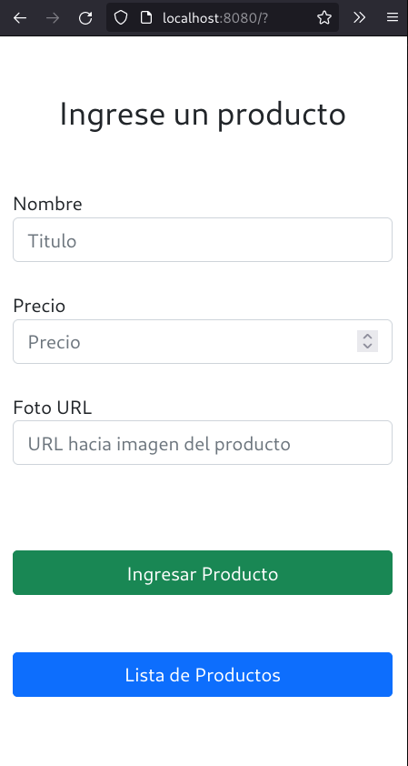
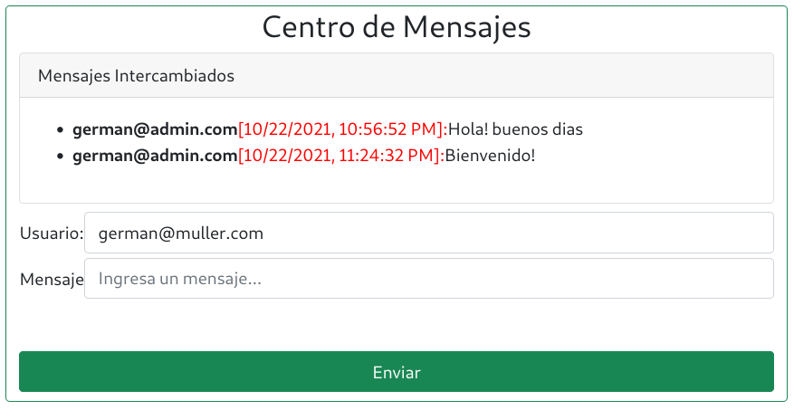

# Curso NodeJS - Entrega 6

## Enunciado General

### Consigna 1
#### Enunciado
Modificar el último entregable para que disponga de un canal de websocket que
permita representar, por debajo del formulario de ingreso, una tabla con la lista de productos en
tiempo real.

* Puede haber varios clientes conectados simultáneamente y en cada uno de ellos se reflejarán
los cambios que se realicen en los productos sin necesidad de recargar la vista.

* Cuando un cliente se conecte, recibirá la lista de productos a representar en la vista.

####  Aspectos a incluir en el entregable
Para construir la tabla dinámica con los datos recibidos por websocket utilizar Handlebars en el
frontend. Considerar usar archivos públicos para alojar la plantilla vacía, y obtenerla usando la
función fetch( ). Recordar que fetch devuelve una promesa.

### Consigna 2
#### Enunciado
Añadiremos al proyecto un canal de chat entre los clientes y el servidor.


#### Aspectos a incluir en el entregable:
* En la parte inferior del formulario de ingreso se presentará el centro de mensajes almacenados en el
servidor, donde figuren los mensajes de todos los usuarios identificados por su email.
* El formato a representar será: email (texto negrita en azul) [fecha y hora (DD/MM/YYYY HH:MM:SS)](texto normal en marrón) : mensaje (texto italic en verde)
* Además incorporar dos elementos de entrada: uno para que el usuario ingrese su email (obligatorio para poder utilizar el chat) y otro para ingresar mensajes y enviarlos mediante un botón.
* *Los mensajes deben persistir en el servidor en un archivo (ver segundo entregable).

## Screenshots



La aplicacion de chat se agrega al final, empleando un Spinner para simular el proceso de carga de la DB. Luego de 10 segundos, se actualiza el segmento correspondiente a la aplicacion de chat.

Durante la inicialización del servidor:


Luego se habilita la app de mensajería:




## Información para pruebas
### Formato JSON
```
{
    "title": "Escuadra",
    "price": 123.45,
    "thumbnail": "https://cdn3.iconfinder.com/data/icons/education-209/64/ruler-triangle-stationary-school-512.png"
}
{
    "title": "Calculadora",
    "price": 234.56,
    "thumbnail": "https://cdn3.iconfinder.com/data/icons/education-209/64/calculator-math-tool-school-512.png"
}
{
    "title": "Globo Terraqueo",
    "price": 345.67,
    "thumbnail": "https://cdn3.iconfinder.com/data/icons/education-209/64/globe-earth-geograhy-planet-school-512.png"
}
```

### Script Curl
```
curl -d '{"title": "Escuadra", "price": 123.45, "thumbnail": "https://cdn3.iconfinder.com/data/icons/education-209/64/ruler-triangle-stationary-school-512.png"}' -H "Content-Type: application/json" -X POST http://localhost:8080/api/productos

curl -d '{"title": "Calculadora","price": 234.56,"thumbnail": "https://cdn3.iconfinder.com/data/icons/education-209/64/calculator-math-tool-school-512.png"}' -H "Content-Type: application/json" -X POST http://localhost:8080/api/productos

curl -d '{"title": "Globo Terraqueo","price": 345.67,"thumbnail": "https://cdn3.iconfinder.com/data/icons/education-209/64/globe-earth-geograhy-planet-school-512.png"}' -H "Content-Type: application/json" -X POST http://localhost:8080/api/productos
```