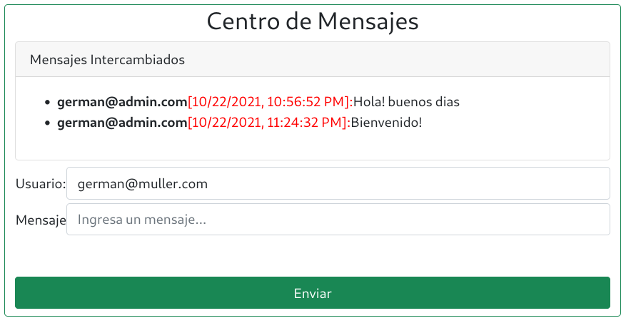

# Curso NodeJS - Entrega 7

## Enunciado General

### Consigna 1
Tomando como base las clases Contenedor en memoria y en archivos, desarrollar un nuevo contenedor con idénticos métodos pero que funcione sobre bases de datos, utilizando Knex para la conexión. Esta clase debe recibir en su constructor el objeto de configuración de Knex y el nombre de la tabla sobre la cual trabajará. Luego, modificar el desafío entregable de la clase 11”Chat con Websocket”, y:
* Cambiar la persistencia de los mensajes de filesystem a base de datos SQLite3.
* Cambiar la persistencia de los productos de memoria a base de datos MariaDB.

Desarrollar también un script que utilizando knex cree las tablas necesarias para la persistencia en cuestión (tabla mensajes en sqlite3 y tabla productos en mariaDb).

## Configuración centralizada
Esta versión incluye un archivo de configuración __./config/config.js__ en el cual se detalla toda la configuración de las bases de datos.
```
// Configuracion General del Motor SQL
root = {
    client: 'mysql',
    connection: {
      host: '127.0.0.1',
      user: 'root'    
    }
}

// Configuracion para Productos
productos = {
    server: {
        client: 'mysql',
        connection: {
          host: '127.0.0.1',
          user: 'german',
          password: 'german',
          database: 'ecommerce'
        },
    },

    table: "productos",
}    

// Configuracion para Chats
chat = {
    server: {
        client: 'sqlite3',
        connection: { filename: './db/ecommerce.sqlite' },
        useNullAsDefault: true
    },    
    table: "chat"
}


module.exports = {
    root,
    productos,  
    chat
} ;
```


## Configuración de las Base de Datos
Se incluye un pequeño programa de JavaScript con Knex para la configuración y creación de tablas de cada DB.
```
node ./config/initdb.js [root_password_db]
```

Mediante este programa se configuran las DB necesarias para MariaDB/MySQL y SQLite3.
Este mismo script se encarga de crear el usuario de SQL y asignar los permisos correspondientes.

## Screenshots


La aplicacion de chat se agrega al final, empleando un Spinner para simular el proceso de carga de la DB. Luego de 10 segundos, se actualiza el segmento correspondiente a la aplicacion de chat.

Durante la inicialización del servidor:


Luego se habilita la app de mensajería:




## Información para pruebas
### Formato JSON
```
{
    "title": "Escuadra",
    "price": 123.45,
    "thumbnail": "https://cdn3.iconfinder.com/data/icons/education-209/64/ruler-triangle-stationary-school-512.png"
}
{
    "title": "Calculadora",
    "price": 234.56,
    "thumbnail": "https://cdn3.iconfinder.com/data/icons/education-209/64/calculator-math-tool-school-512.png"
}
{
    "title": "Globo Terraqueo",
    "price": 345.67,
    "thumbnail": "https://cdn3.iconfinder.com/data/icons/education-209/64/globe-earth-geograhy-planet-school-512.png"
}
```

### Script Curl
```
curl -d '{"title": "Escuadra", "price": 123.45, "thumbnail": "https://cdn3.iconfinder.com/data/icons/education-209/64/ruler-triangle-stationary-school-512.png"}' -H "Content-Type: application/json" -X POST http://localhost:8080/api/productos

curl -d '{"title": "Calculadora","price": 234.56,"thumbnail": "https://cdn3.iconfinder.com/data/icons/education-209/64/calculator-math-tool-school-512.png"}' -H "Content-Type: application/json" -X POST http://localhost:8080/api/productos

curl -d '{"title": "Globo Terraqueo","price": 345.67,"thumbnail": "https://cdn3.iconfinder.com/data/icons/education-209/64/globe-earth-geograhy-planet-school-512.png"}' -H "Content-Type: application/json" -X POST http://localhost:8080/api/productos
```