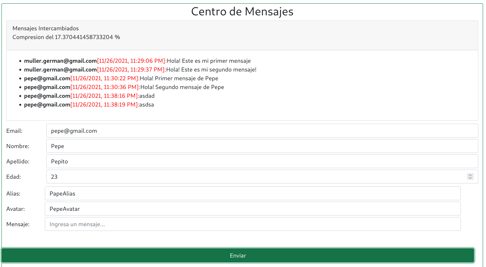
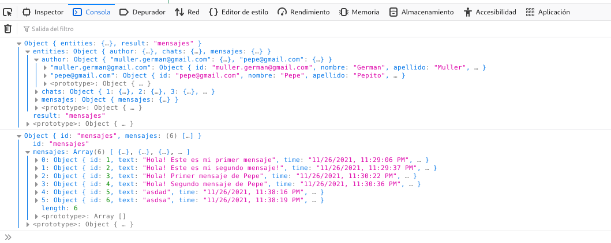
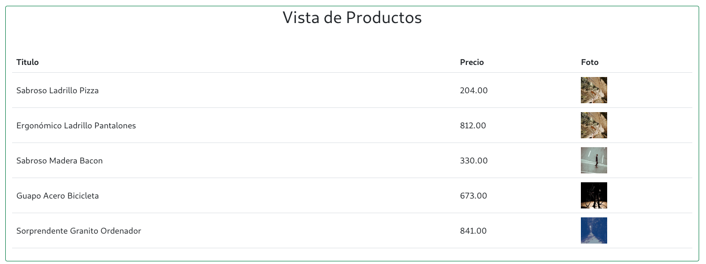

# Curso NodeJS - Entrega 9

## Enunciado General

### Consigna 1
TSobre el desafío entregable de la clase 16, crear una vista en forma de tabla que consuma desde la ruta ‘/api/productos-test’ del servidor una lista con 5 productos generados al azar utilizando Faker.js como generador de información aleatoria de test (en lugar de tomarse desde la base de
datos). Elegir apropiadamente los temas para conformar el objeto ‘producto’ (nombre, precio y foto).

### Consigna 2
Ahora, vamos a reformar el formato de los mensajes y la forma de comunicación del chat (centro de mensajes).El nuevo formato de mensaje será:

```javascript
{
    author: {
        id: 'mail del usuario' ,
        nombre: 'nombre del usuario' ,
        apellido: 'apellido del usuario' ,
        edad: 'edad del usuario' ,
        alias: 'alias del usuario' ,
        avatar: 'url avatar (foto, logo) del usuario'
    },
    text: 'mensaje del usuario'
}
```

### Aspectos a incluir en el entregable

1. Modificar la persistencia de los mensajes para que utilicen un contenedor que permita guardar objetos anidados (archivos, mongodb, firebase).
2. El mensaje se envía del frontend hacia el backend, el cual lo almacenará en la base de datos elegida. Luego cuando el cliente se conecte o envie un mensaje, recibirá un array de mensajes a representar en su vista.
3. El array que se devuelve debe estar normalizado con normalizr, conteniendo una entidad de autores. Considerar que el array tiene sus autores con su correspondiente id (mail del usuario), pero necesita incluir para el proceso de normalización un id para todo el array en
su conjunto (podemos asignarle nosotros un valor fijo). Ejemplo: { id: ‘mensajes’, mensajes: [ ] }
4. El frontend debería poseer el mismo esquema de normalización que el backend, para que este pueda desnormalizar y presentar la información adecuada en la vista.
5. Considerar que se puede cambiar el nombre del id que usa normalizr, agregando un tercer parametro a la función schema.Entity, por ejemplo:
```javascript
const schemaAuthor = new schema.Entity('author',{...},{idAttribute: 'email'});
```
6.Presentar en el frontend (a modo de test) el porcentaje de compresión de los mensajes recibidos. Puede ser en el título del centro de mensajes.


## Configuración centralizada
Esta versión incluye un archivo de configuración __./config/config.js__ en el cual se detalla toda la configuración de las bases de datos.
```
// Configuracion General del Motor SQL
root = {
    client: 'mysql',
    connection: {
      host: '127.0.0.1',
      user: 'root'    
    }
}

// Configuracion para Productos
productos = {
    server: {
        client: 'mysql',
        connection: {
          host: '127.0.0.1',
          user: 'german',
          password: 'german',
          database: 'ecommerce'
        },
    },
    table: "productos",
}    

// Configuracion para Chats
chat_authors = {
    server: {
        client: 'sqlite3',
        connection: { filename: './db/ecommerce.sqlite' },
        useNullAsDefault: true
    },    
    table: "autores",
}

chat_msg = {
    server: {
        client: 'sqlite3',
        connection: { filename: './db/ecommerce.sqlite' },
        useNullAsDefault: true
    },    
    table: "mensages",
}


module.exports = {
    root,
    productos,  
    chat_authors,
    chat_msg
} ;
```


## Configuración de las Base de Datos
Se incluye un pequeño programa de JavaScript con Knex para la configuración y creación de tablas de cada DB.
```
node ./config/initdb.js [root_password_db]
```

Mediante este programa se configuran las DB necesarias para MariaDB/MySQL y SQLite3.
Este mismo script se encarga de crear el usuario de SQL y asignar los permisos correspondientes.

## Screenshots


La aplicacion de chat se agrega al final, empleando un Spinner para simular el proceso de carga de la DB. Luego de 10 segundos, se actualiza el segmento correspondiente a la aplicacion de chat.

### Durante la inicialización del servidor:


### Luego se habilita la app de mensajería:


### Normalizacion/Desnormalizacion en el FrontEnd:


### Vista de Mock de Productos



## Información para pruebas
### Formato JSON
```
{
    "title": "Escuadra",
    "price": 123.45,
    "thumbnail": "https://cdn3.iconfinder.com/data/icons/education-209/64/ruler-triangle-stationary-school-512.png"
}
{
    "title": "Calculadora",
    "price": 234.56,
    "thumbnail": "https://cdn3.iconfinder.com/data/icons/education-209/64/calculator-math-tool-school-512.png"
}
{
    "title": "Globo Terraqueo",
    "price": 345.67,
    "thumbnail": "https://cdn3.iconfinder.com/data/icons/education-209/64/globe-earth-geograhy-planet-school-512.png"
}
```

### Script Curl
```
curl -d '{"title": "Escuadra", "price": 123.45, "thumbnail": "https://cdn3.iconfinder.com/data/icons/education-209/64/ruler-triangle-stationary-school-512.png"}' -H "Content-Type: application/json" -X POST http://localhost:8080/api/productos

curl -d '{"title": "Calculadora","price": 234.56,"thumbnail": "https://cdn3.iconfinder.com/data/icons/education-209/64/calculator-math-tool-school-512.png"}' -H "Content-Type: application/json" -X POST http://localhost:8080/api/productos

curl -d '{"title": "Globo Terraqueo","price": 345.67,"thumbnail": "https://cdn3.iconfinder.com/data/icons/education-209/64/globe-earth-geograhy-planet-school-512.png"}' -H "Content-Type: application/json" -X POST http://localhost:8080/api/productos
```