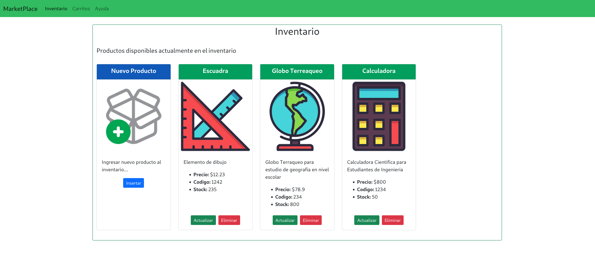
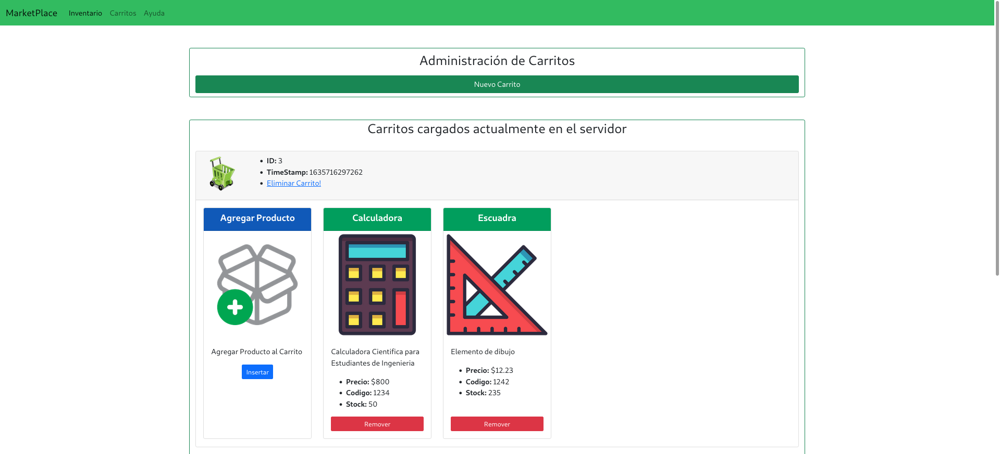

# Curso NodeJS - Proyecto Final
## Primera Entrega

## Enunciado General

### Consigna 1
#### Enunciado
Deberás entregar el estado de avance de tu aplicación eCommerce Backend, que implemente un servidor de aplicación basado en la plataforma Node.js y el middleware express. El servidor implementará dos conjuntos de rutas agrupadas en routers, uno con la url base '/productos' y el otro con '/carrito'. El puerto de escucha será el 8080 para desarrollo y process.env.PORT para producción en glitch.com

####  Aspectos a incluir en el entregable
1. El router base '/api/productos' implementará cuatro funcionalidades:
* GET: '/:id?' - Me permite listar todos los productos disponibles ó un producto por su id (disponible para usuarios y administradores)
* POST: '/' - Para incorporar productos al listado (disponible para administradores)
* PUT: '/:id' - Actualiza un producto por su id (disponible para administradores)
* DELETE: '/:id' - Borra un producto por su id (disponible para administradores)

2. El router base '/api/carrito' implementará tres rutas disponibles para usuarios y administradores:
* POST: '/' - Crea un carrito y devuelve su id.
* DELETE: '/:id' - Vacía un carrito y lo elimina.
* GET: '/:id/productos' - Me permite listar todos los productos guardados en el carrito
* POST: '/:id/productos' - Para incorporar productos al carrito por su id de producto
* DELETE: '/:id/productos/:id_prod' - Eliminar un producto del carrito por su id de carrito y deproducto

3. Crear una variable booleana administrador, cuyo valor configuraremos más adelante con el sistema de login. Según su valor (true ó false) me permitirá alcanzar o no las rutas indicadas. En el caso de recibir un request a una ruta no permitida por el perfil, devolver un objeto de error. Ejemplo: { error : -1, descripcion: ruta 'x' método 'y' no autorizada}

4. Un producto dispondrá de los siguientes campos: id, timestamp, nombre, descripcion, código, foto (url), precio, stock.

5. El carrito de compras tendrá la siguiente estructura: id, timestamp(carrito), producto: { id, timestamp(producto), nombre, descripcion, código, foto (url), precio, stock }

6. El timestamp puede implementarse con Date.now()

7. Comenzar a trabajar con el listado de productos y el carrito de compras en memoria del servidor, luego persistirlos en el filesystem.

### Consigna 2
#### Enunciado
Añadiremos al proyecto un canal de chat entre los clientes y el servidor.


#### Aspectos a incluir en el entregable:
* En la parte inferior del formulario de ingreso se presentará el centro de mensajes almacenados en el
servidor, donde figuren los mensajes de todos los usuarios identificados por su email.
* El formato a representar será: email (texto negrita en azul) [fecha y hora (DD/MM/YYYY HH:MM:SS)](texto normal en marrón) : mensaje (texto italic en verde)
* Además incorporar dos elementos de entrada: uno para que el usuario ingrese su email (obligatorio para poder utilizar el chat) y otro para ingresar mensajes y enviarlos mediante un botón.
* *Los mensajes deben persistir en el servidor en un archivo (ver segundo entregable).

## Screnshots
A continuación se observan las imágenes correspondientes al frontend.

### Interfaz para control del Inventario



### Interfaz para control de Carritos


## Información para pruebas
### Formato JSON
```
[
  {
    "nombre": "Escuadra",
    "descripcion": "Elemento de dibujo",
    "codigo": "1234",
    "precio": "45.34",
    "stock": "100",
    "foto": "https://cdn3.iconfinder.com/data/icons/education-209/64/ruler-triangle-stationary-school-512.png"
  },
  {
    "nombre": "Calculadora",
    "descripcion": "Calculadora Cientifica para Estudiantes de Ingenieria",
    "codigo": "2345",
    "precio": "1500",
    "stock": "20",
    "foto": "https://cdn3.iconfinder.com/data/icons/education-209/64/calculator-math-tool-school-512.png"
  },
  {
    "nombre": "Globo Terreaqueo",
    "descripcion": "Globo Terraqueo para estudio de geografia en nivel escolar",
    "codigo": "643",
    "precio": "800",
    "stock": "40",
    "foto": "https://cdn3.iconfinder.com/data/icons/education-209/64/globe-earth-geograhy-planet-school-512.png"
  }
]
```

### Script Curl
```
curl -d '{"nombre": "Escuadra","descripcion": "Elemento de dibujo","codigo": "1234","precio": "45.34","stock": "100","foto": "https://cdn3.iconfinder.com/data/icons/education-209/64/ruler-triangle-stationary-school-512.png"}' -H "Content-Type: application/json" -X POST http://localhost:8080/api/productos
```

```
curl -d '{"nombre": "Calculadora","descripcion": "Calculadora Cientifica para Estudiantes de Ingenieria","codigo": "2345","precio": "1500","stock": "20","foto": "https://cdn3.iconfinder.com/data/icons/education-209/64/calculator-math-tool-school-512.png"}' -H "Content-Type: application/json" -X POST http://localhost:8080/api/productos
```

```
curl -d '{"nombre": "Globo Terreaqueo","descripcion": "Globo Terraqueo para estudio de geografia en nivel escolar","codigo": "643","precio": "800",  "stock": "40","foto": "https://cdn3.iconfinder.com/data/icons/education-209/64/globe-earth-geograhy-planet-school-512.png"}' -H "Content-Type: application/json" -X POST http://localhost:8080/api/productos
```


