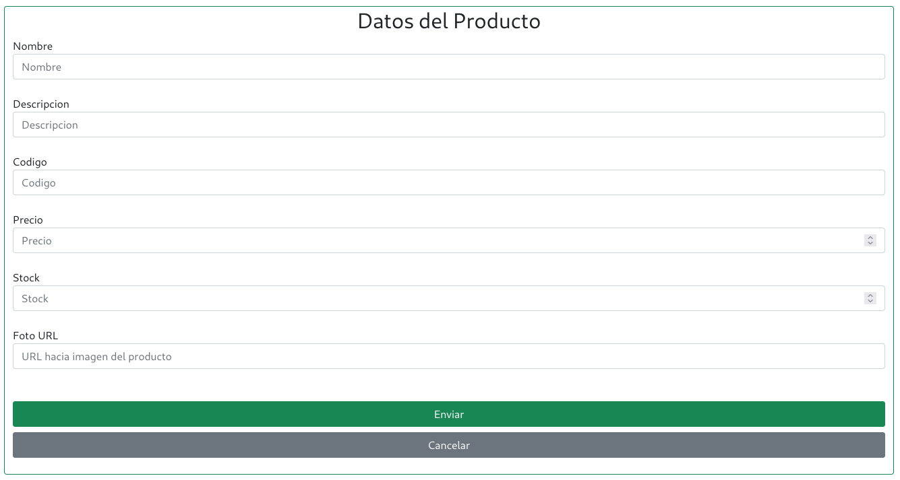
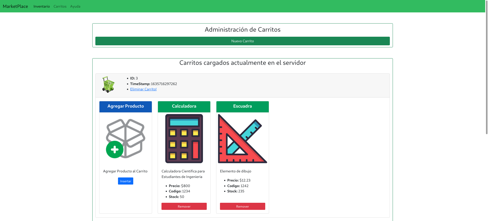

# Curso NodeJS - Proyecto Final
## Segunda Entrega

## Enunciado General

### Consigna 1
#### Enunciado
Basándose en los contenedores ya desarrollados (memoria, archivos) desarrollar dos contenedores más (que cumplan con la misma interfaz) que permitan realizar las operaciones básicas de CRUD en MongoDb (ya sea local o remoto) y en Firebase. Luego, para cada contenedor, crear dos clases derivadas, una para trabajar con Productos, y otra para trabajar con Carritos.

#### Aspectos a incluir en el entregable:

* A las clases derivadas de los contenedores se las conoce como DAOs (Data Access Objects),y pueden ir todas incluidas en una misma carpeta de ‘daos’.

* En la carpeta de daos, incluir un archivo que importe todas las clases y exporte una instancia de dao de productos y una de dao de carritos, según corresponda. Esta decisión se tomará en base al valor de una variable de entorno cargada al momento de ejecutar el servidor (opcional: investigar el uso de imports dinámicos).

* Incluir un archivo de configuración (config) que contenga los datos correspondientes para conectarse a las bases de datos o medio de persistencia que corresponda.

## Screnshots
A continuación se observan las imágenes correspondientes al frontend.

### Interfaz para control del Inventario




### Interfaz para control de Carritos


## Información para pruebas
### Formato JSON
```
[
  {
    "nombre": "Escuadra",
    "descripcion": "Elemento de dibujo",
    "codigo": "1234",
    "precio": "45.34",
    "stock": "100",
    "foto": "https://cdn3.iconfinder.com/data/icons/education-209/64/ruler-triangle-stationary-school-512.png"
  },
  {
    "nombre": "Calculadora",
    "descripcion": "Calculadora Cientifica para Estudiantes de Ingenieria",
    "codigo": "2345",
    "precio": "1500",
    "stock": "20",
    "foto": "https://cdn3.iconfinder.com/data/icons/education-209/64/calculator-math-tool-school-512.png"
  },
  {
    "nombre": "Globo Terreaqueo",
    "descripcion": "Globo Terraqueo para estudio de geografia en nivel escolar",
    "codigo": "643",
    "precio": "800",
    "stock": "40",
    "foto": "https://cdn3.iconfinder.com/data/icons/education-209/64/globe-earth-geograhy-planet-school-512.png"
  }
]
```

### Script Curl
```
curl -d '{"nombre": "Escuadra","descripcion": "Elemento de dibujo","codigo": "1234","precio": "45.34","stock": "100","foto": "https://cdn3.iconfinder.com/data/icons/education-209/64/ruler-triangle-stationary-school-512.png"}' -H "Content-Type: application/json" -X POST http://localhost:8080/api/productos
```

```
curl -d '{"nombre": "Calculadora","descripcion": "Calculadora Cientifica para Estudiantes de Ingenieria","codigo": "2345","precio": "1500","stock": "20","foto": "https://cdn3.iconfinder.com/data/icons/education-209/64/calculator-math-tool-school-512.png"}' -H "Content-Type: application/json" -X POST http://localhost:8080/api/productos
```

```
curl -d '{"nombre": "Globo Terreaqueo","descripcion": "Globo Terraqueo para estudio de geografia en nivel escolar","codigo": "643","precio": "800",  "stock": "40","foto": "https://cdn3.iconfinder.com/data/icons/education-209/64/globe-earth-geograhy-planet-school-512.png"}' -H "Content-Type: application/json" -X POST http://localhost:8080/api/productos
```


