# Curso NodeJS - Proyecto Final
## Tercera Entrega

### Consigna
#### Enunciado
Un menú de registro y autenticación de usuarios basado en passport local, guardando en la base de datos las credenciales y el resto de los datos ingresados al momento del registro.

* El registro de usuario consiste en crear una cuenta en el servidor almacenada en la base de datos, que contenga el email y password de usuario, además de su nombre, dirección, edad, número de teléfono (debe contener todos los prefijos internacionales) y foto ó avatar. La contraseña se almacenará encriptada en la base de datos.

* La imagen se podrá subir al servidor y se guardará en una carpeta pública del mismo a la cual se tenga acceso por url.

Un formulario post de registro y uno de login. De modo que, luego de concretarse cualquiera de estas operaciones en forma exitosa, el usuario accederá a su home.

* El usuario se logueará al sistema con email y password y tendrá acceso a un menú en su vista, a modo de barra de navegación. Esto le permitirá ver los productos totales con los filtros que se hayan implementado y su propio carrito de compras e información propia (datos de registro con la foto). Además, dispondrá de una opción para desloguearse del sistema.

* Ante la incorporación de un usuario, el servidor enviará un email al administrador con todos los datos de registro y asunto 'nuevo registro', a una dirección que se encuentre por el momento almacenada en una constante global.

Envío de un email y un mensaje de whatsapp al administrador desde el servidor, a un número de contacto almacenado en una constante global.

* El usuario iniciará la acción de pedido en la vista del carrito.

* Será enviado una vez finalizada la elección para la realizar la compra de productos.

* El email contendrá en su cuerpo la lista completa de productos a comprar y en el asunto la frase 'nuevo pedido de ' y el nombre y email del usuario que los solicitó. En el mensaje de whatsapp se debe enviar la misma información del asunto del email.

* El usuario recibirá un mensaje de texto al número que haya registrado, indicando que su pedido ha sido recibido y se encuentra en proceso.

#### Aspectos a incluir en el entregable:

* El servidor trabajará con una base de datos DBaaS (Ej. MongoDB Atlas) y estará preparado para trabajar en forma local o en la nube a través de la plataforma PaaS Heroku.

* Habilitar el modo cluster para el servidor, como opcional a través de una constante global.

* Utilizar alguno de los loggers ya vistos y así reemplazar todos los mensajes a consola por logs eficientes hacia la misma consola. En el caso de errores moderados ó graves el log tendrá además como destino un archivo elegido.

* Realizar una prueba de performance en modo local, con y sin cluster, utilizando Artillery en el endpoint del listado de productos (con el usuario vez logueado). Verificar los resultados.

-----------------------------------------------------------------------------------------------------------------------------

## Screnshots
A continuación se observan las imágenes correspondientes al frontend.

### Login/Register
Pantalla inicial para login del usuario.

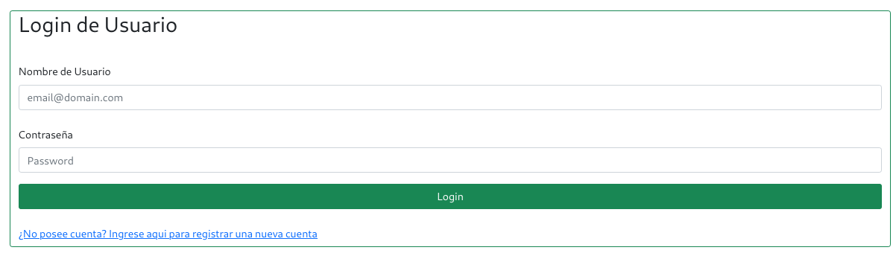

En caso de registrar un nuevo usuario, se debe completar el siguiente formulario:

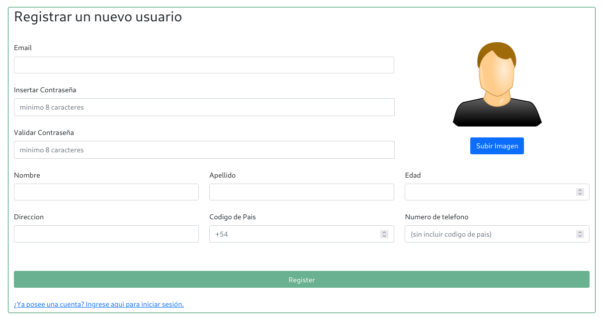

### Vista de Usuario
#### Catálogo
Vista principal de usuario con acceso al todo el catálogo disponible para compras.

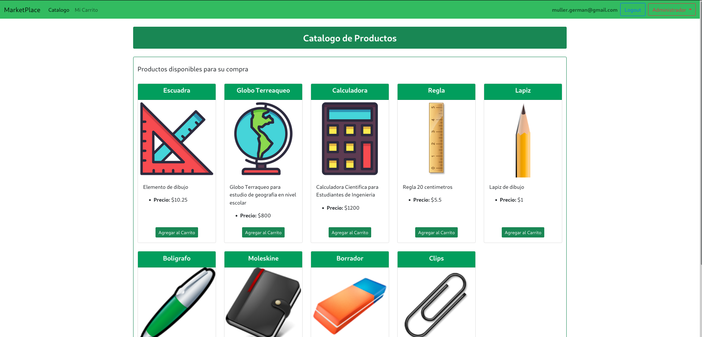

#### Mi Carrito
Vista del carrito propio del usuario

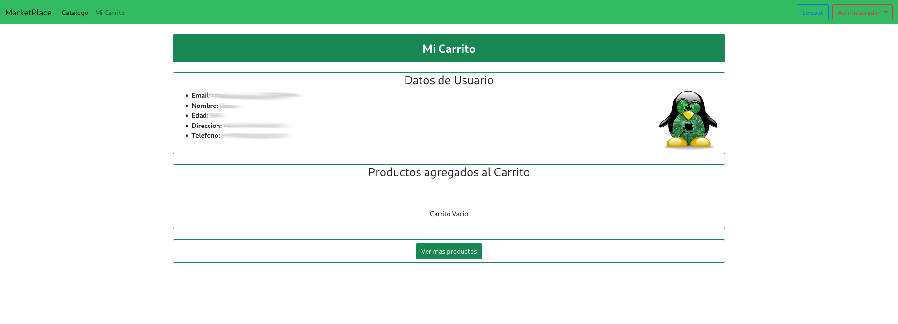

Luego al momento de incorporar productos, los mismos se incorporan al carrito:

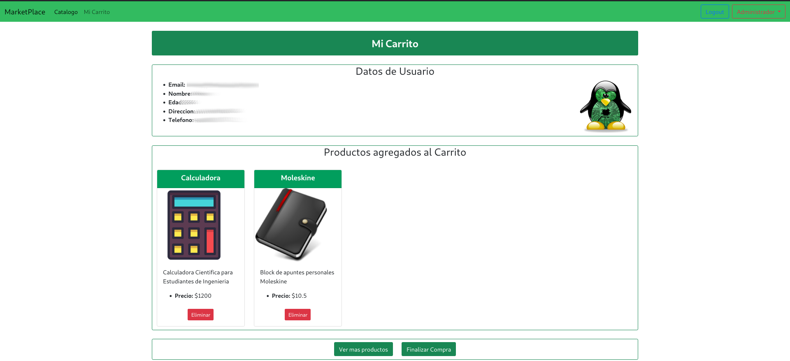

Por ultimo, al finalizar la compra, se activa un spinner mientras la misma es procesada, y luego se emite el alert en la parte superior:

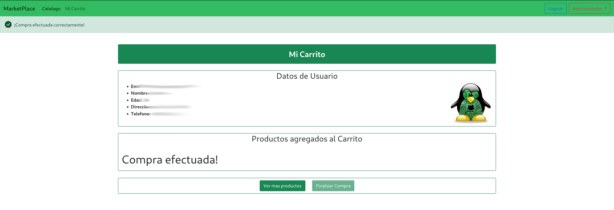

### Vista de Administrador
El administrador posee la capacidad de incluir, modificar y eliminar productos del inventario desde su propia interfaz


-----------------------------------------------------------------------------------------------------------------------------

## Información para pruebas
### Formato JSON
```
[
  {
    "nombre": "Escuadra",
    "descripcion": "Elemento de dibujo",
    "codigo": "1234",
    "precio": "45.34",
    "stock": "100",
    "foto": "https://cdn3.iconfinder.com/data/icons/education-209/64/ruler-triangle-stationary-school-512.png"
  },
  {
    "nombre": "Calculadora",
    "descripcion": "Calculadora Cientifica para Estudiantes de Ingenieria",
    "codigo": "2345",
    "precio": "1500",
    "stock": "20",
    "foto": "https://cdn3.iconfinder.com/data/icons/education-209/64/calculator-math-tool-school-512.png"
  },
  {
    "nombre": "Globo Terreaqueo",
    "descripcion": "Globo Terraqueo para estudio de geografia en nivel escolar",
    "codigo": "643",
    "precio": "800",
    "stock": "40",
    "foto": "https://cdn3.iconfinder.com/data/icons/education-209/64/globe-earth-geograhy-planet-school-512.png"
  }
]
```

### Script Curl
```
curl -d '{"nombre": "Escuadra","descripcion": "Elemento de dibujo","codigo": "1234","precio": "45.34","stock": "100","foto": "https://cdn3.iconfinder.com/data/icons/education-209/64/ruler-triangle-stationary-school-512.png"}' -H "Content-Type: application/json" -X POST http://localhost:8080/api/productos
```

```
curl -d '{"nombre": "Calculadora","descripcion": "Calculadora Cientifica para Estudiantes de Ingenieria","codigo": "2345","precio": "1500","stock": "20","foto": "https://cdn3.iconfinder.com/data/icons/education-209/64/calculator-math-tool-school-512.png"}' -H "Content-Type: application/json" -X POST http://localhost:8080/api/productos
```

```
curl -d '{"nombre": "Globo Terreaqueo","descripcion": "Globo Terraqueo para estudio de geografia en nivel escolar","codigo": "643","precio": "800",  "stock": "40","foto": "https://cdn3.iconfinder.com/data/icons/education-209/64/globe-earth-geograhy-planet-school-512.png"}' -H "Content-Type: application/json" -X POST http://localhost:8080/api/productos
```

-----------------------------------------------------------------------------------------------------------------------------

## Estructura del Software

El proyecto se organizó en dos bloques correspondientes al BE y FE, donde en cada uno de ellos se implemento una estructura en capas. A continuación se adjuntan el esquema UML correspondiente al BE:

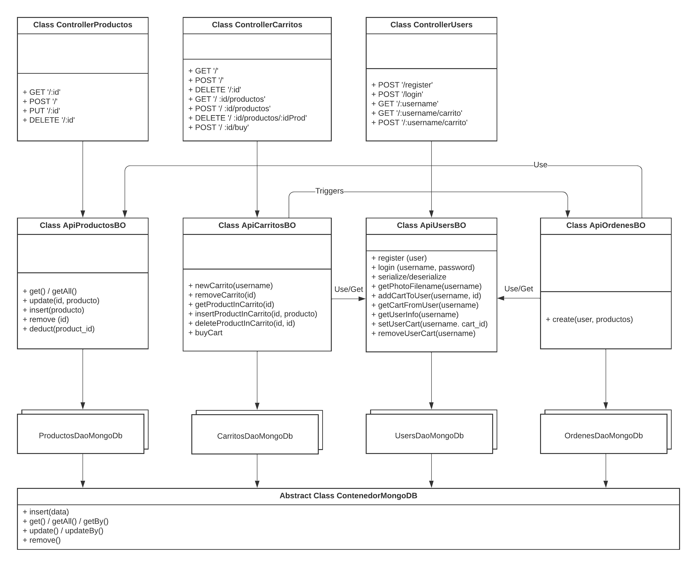


-----------------------------------------------------------------------------------------------------------------------------

## Configuración

Para la correcta ejecución del programa se requiere disponer de diversas cuentas (PaaS y DBaSS):

* __MongoDB__: Empleado como persistencia.
* __Sendgrid__: Empleado mediante NodeMailer
* __Twilio__: Empleado para notificaciones de SMS y Whatsapp

Con esta información se debe cargar un archivo "config.env" en el directorio raiz del proyecto. El mismo debe contener la siguiente información:

```bash
# Configuraciones Base
BASE_URL = "http://localhost"
API_SERVER_PORT = 8081
WEB_SERVER_PORT = 8080

# Datos del Administrador
ADMIN_EMAIL = ""
ADMIN_WHATSAPP = ""

# Configuraciones de MongoDB
MONGODB_SERVER = ""
MONGODB_USER = ""
MONGODB_PASS = ""

# Configuraciones de Firebase (Solo para Modo 3)
FIREBASE_JSON_CONFIG = ""

# Configuraciones de SendGrip
SENDGRIP_API = ""

# Configuraciones de Twilio
TWILIO_ACCOUNT = ""
TWILIO_TOKEN = ""
TWILIO_SMS_SOURCE = ""
TWILIO_WHATSAPP_SANDBOX = ""
``

-----------------------------------------------------------------------------------------------------------------------------

## Performance

Se realizaron pruebas de performance mediante el uso de Artillery.io, obteniendo los siguientes resultados.
Para la ejecución de las pruebas se empleó el siguiente escenario:

```yaml
config:
  target: "http://localhost:8080"
  http:
  # Responses have to be sent within 10 seconds, or an `ETIMEDOUT` error gets raised.
  timeout: 15
  phases:
    - duration: 1
      arrivalRate: 100
  variables:
    email:
      - "[user]"

scenarios:
  # In this scenario, the request to /login will capture the user's
  # email and set it in a cookie, which will get returned in the response.
  # The subsequent request to /account will return the value of the
  # email from the saved cookie.
  - name: "Login and verify cookie"
    flow:
    - get:
        url: "/login"
    - post:
        url: "/login"
        json:
          username: "[user]"
          password: "[pass]"
        followRedirect: false
    - think: 1
    - get:
        url: "/productos"
    - think: 2
    - get:
        url: "/logout"
    - think: 1
 
```

El mismo permite simular un caso de navegación donde el usuario se loguea en el sitio, accede al catálogo de productos y luego de unos segundos realiza una operación de logout.


### Modo Fork
En este modo se establece una única instancia que maneja tanto el FE como el BE:

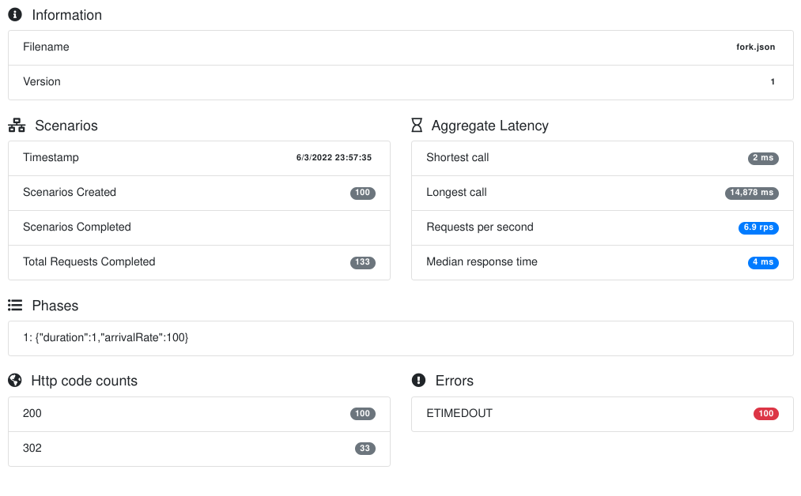
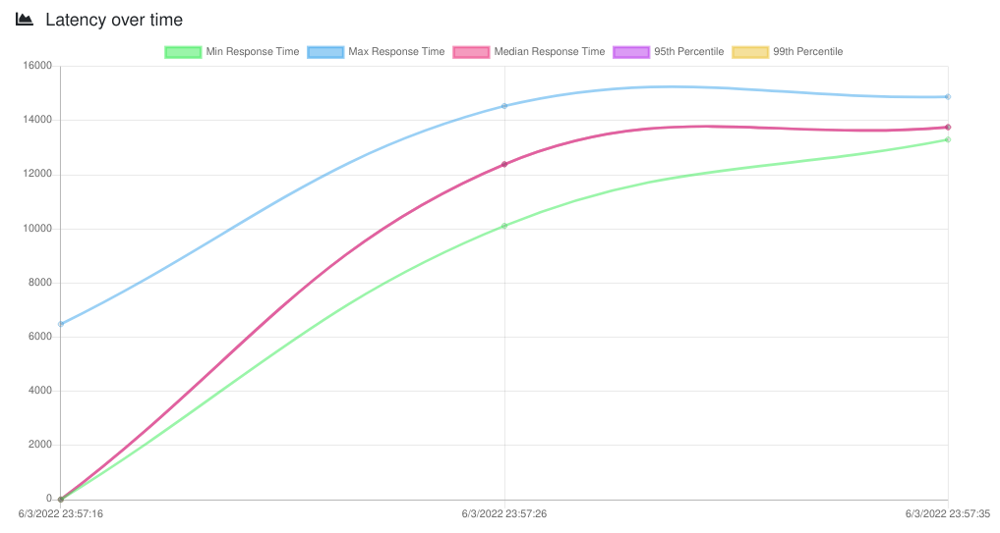
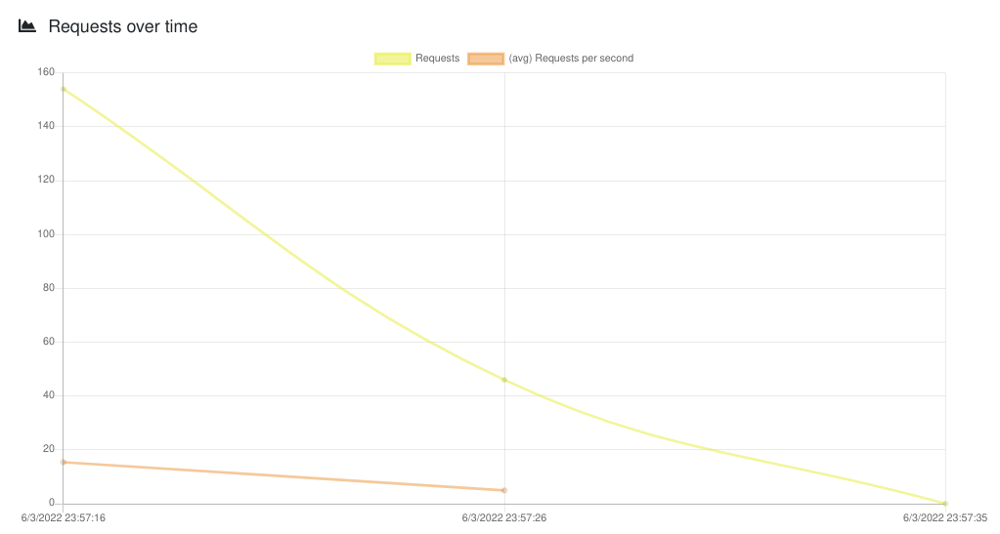
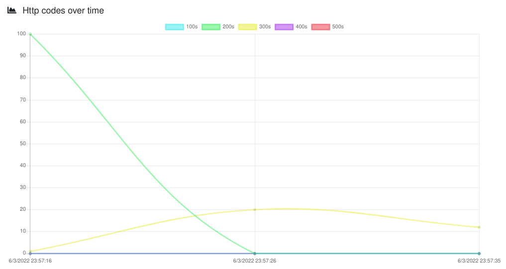
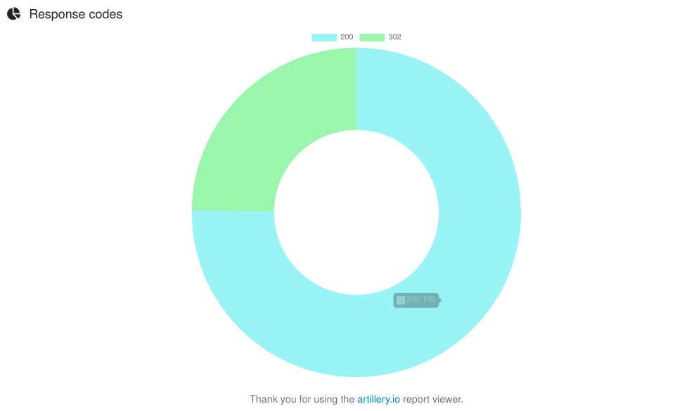


### Modo Cluster
En este modo se inicializa una instancia para el FE y 8 instancias (threads) para el BE:

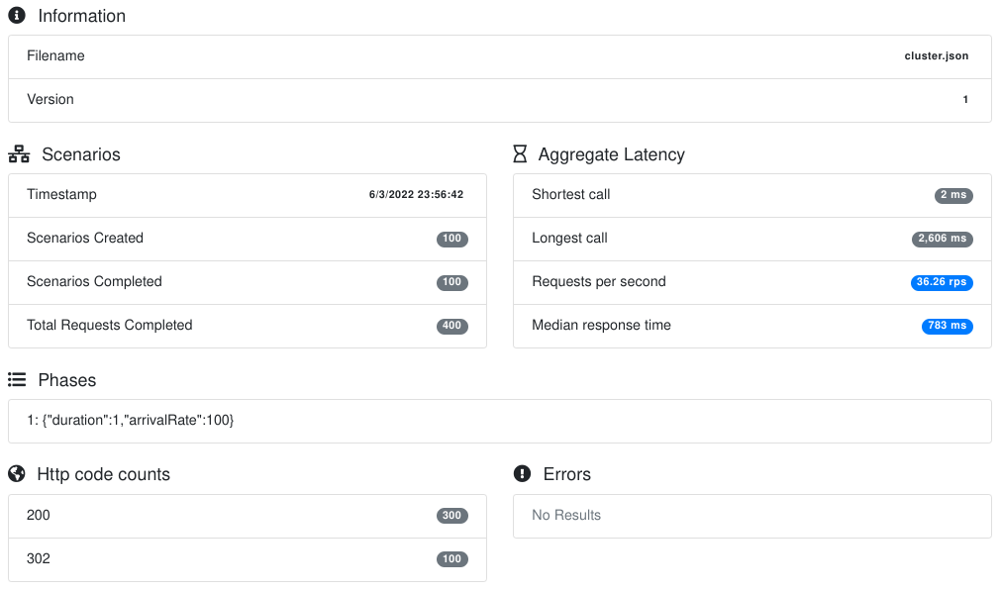
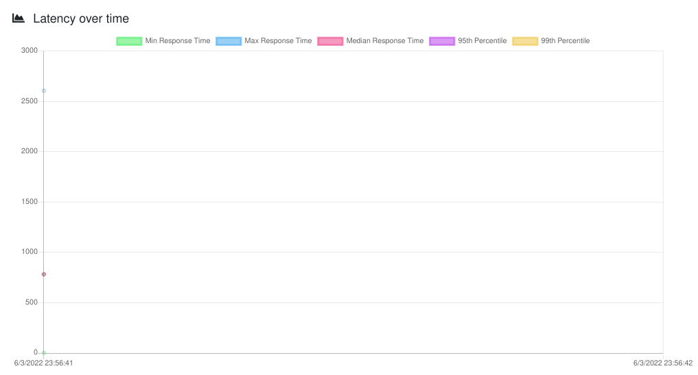
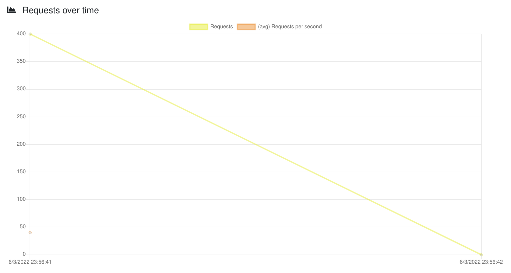
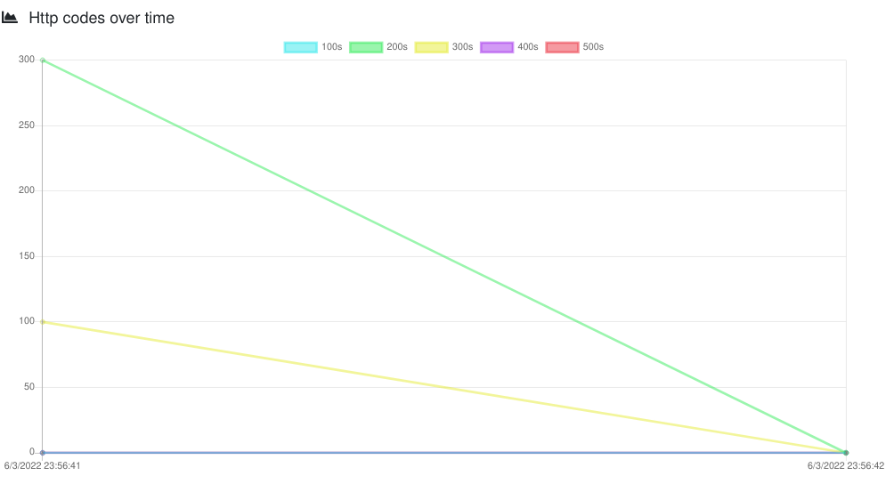
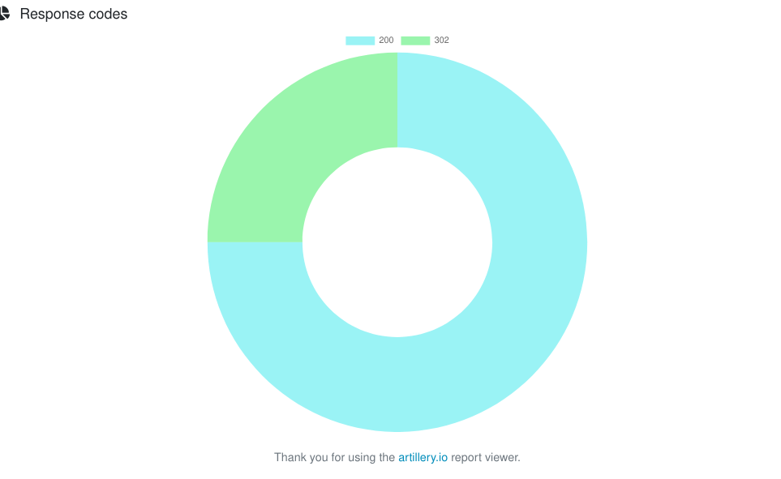

Se verifica que en el modo Cluster el Server es capaz de procesar una gran cantidad de sesiones de forma más eficiente.

