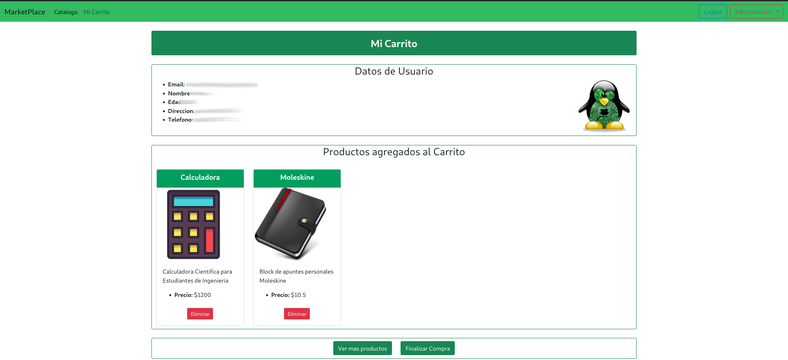

# Curso NodeJS - Proyecto Final
## Entrega Final

[](https://www.javascript.com) 

[](https://npmjs.com/package/express)

[](https://npmjs.com/package/express)

[](http://shields.io/)

## Deployed 
El sitio se encuentra hosteado en Heroku (PaaS) bajo el siguiente link:

[https://glm-project.herokuapp.com](https://glm-project.herokuapp.com)


## Tabla de Contenido
<!-- vscode-markdown-toc -->
* 1. [Entrega Final](#EntregaFinal)
* 2. [Consigna](#Consigna)
	* 2.1. [Enunciado 1ra entrega](#Enunciado1raentrega)
	* 2.2. [Enunciado 2da entrega](#Enunciado2daentrega)
	* 2.3. [Enunciado 3ra entrega](#Enunciado3raentrega)
	* 2.4. [Enunciado 4ta entrega](#Enunciado4taentrega)
* 3. [Screnshots](#Screnshots)
	* 3.1. [Login/Register](#LoginRegister)
	* 3.2. [Vista de Usuario](#VistadeUsuario)
		* 3.2.1. [Catálogo](#Catlogo)
		* 3.2.2. [Mi Carrito](#MiCarrito)
	* 3.3. [Vista de Administrador](#VistadeAdministrador)
* 4. [Información para pruebas](#Informacinparapruebas)
	* 4.1. [Formato JSON](#FormatoJSON)
	* 4.2. [Script Curl](#ScriptCurl)
* 5. [Estructura del Software](#EstructuradelSoftware)
* 6. [Configuración](#Configuracin)
* 7. [Performance](#Performance)
	* 7.1. [Modo Fork](#ModoFork)
	* 7.2. [Modo Cluster](#ModoCluster)

<!-- vscode-markdown-toc-config
	numbering=true
	autoSave=true
	/vscode-markdown-toc-config -->
<!-- /vscode-markdown-toc -->

---

##  2. <a name='Consigna'></a>Consigna
###  2.1. <a name='Enunciado1raentrega'></a>Enunciado 1ra entrega 
Deberás entregar el estado de avance de tu aplicación eCommerce Backend, que implemente un servidor de aplicación basado en la plataforma Node.js y el middleware express. El servidor implementará dos conjuntos de rutas agrupadas en routers, uno con la url base '/productos' y el otro con '/carrito'. 

__Aspectos a incluir en el entregable__
1. El router base '/api/productos' implementará cuatro funcionalidades:
* GET: '/:id?' - Me permite listar todos los productos disponibles ó un producto por su id (disponible para usuarios y administradores)
* POST: '/' - Para incorporar productos al listado (disponible para administradores)
* PUT: '/:id' - Actualiza un producto por su id (disponible para administradores)
* DELETE: '/:id' - Borra un producto por su id (disponible para administradores)

2. El router base '/api/carrito' implementará tres rutas disponibles para usuarios y administradores:
* POST: '/' - Crea un carrito y devuelve su id.
* DELETE: '/:id' - Vacía un carrito y lo elimina.
* GET: '/:id/productos' - Me permite listar todos los productos guardados en el carrito
* POST: '/:id/productos' - Para incorporar productos al carrito por su id de producto
* DELETE: '/:id/productos/:id_prod' - Eliminar un producto del carrito por su id de carrito y deproducto

3. Crear una variable booleana administrador, cuyo valor configuraremos más adelante con el sistema de login. Según su valor (true ó false) me permitirá alcanzar o no las rutas indicadas. En el caso de recibir un request a una ruta no permitida por el perfil, devolver un objeto de error. Ejemplo: { error : -1, descripcion: ruta 'x' método 'y' no autorizada}

4. Un producto dispondrá de los siguientes campos: id, timestamp, nombre, descripcion, código, foto (url), precio, stock.

5. El carrito de compras tendrá la siguiente estructura: id, timestamp(carrito), producto: { id, timestamp(producto), nombre, descripcion, código, foto (url), precio, stock }

6. El timestamp puede implementarse con Date.now()

7. Comenzar a trabajar con el listado de productos y el carrito de compras en memoria del servidor, luego persistirlos en el filesystem.


###  2.2. <a name='Enunciado2daentrega'></a>Enunciado 2da entrega 
Basándose en los contenedores ya desarrollados (memoria, archivos) desarrollar dos contenedores más (que cumplan con la misma interfaz) que permitan realizar las operaciones básicas de CRUD en MongoDb (ya sea local o remoto) y en Firebase. Luego, para cada contenedor, crear dos clases derivadas, una para trabajar con Productos, y otra para trabajar con Carritos.

* A las clases derivadas de los contenedores se las conoce como DAOs (Data Access Objects), y pueden ir todas incluidas en una misma carpeta de ‘daos’.

* En la carpeta de daos, incluir un archivo que importe todas las clases y exporte una instancia de dao de productos y una de dao de carritos, según corresponda. Esta decisión se tomará en base al valor de una variable de entorno cargada al momento de ejecutar el servidor (opcional: investigar el uso de imports dinámicos).

* Incluir un archivo de configuración (config) que contenga los datos correspondientes para conectarse a las bases de datos o medio de persistencia que corresponda.


###  2.3. <a name='Enunciado3raentrega'></a>Enunciado 3ra entrega 
Un menú de registro y autenticación de usuarios basado en passport local, guardando en la base de datos las credenciales y el resto de los datos ingresados al momento del registro.

* El registro de usuario consiste en crear una cuenta en el servidor almacenada en la base de datos, que contenga el email y password de usuario, además de su nombre, dirección, edad, número de teléfono (debe contener todos los prefijos internacionales) y foto ó avatar. La contraseña se almacenará encriptada en la base de datos.

* La imagen se podrá subir al servidor y se guardará en una carpeta pública del mismo a la cual se tenga acceso por url.

Un formulario post de registro y uno de login. De modo que, luego de concretarse cualquiera de estas operaciones en forma exitosa, el usuario accederá a su home.

* El usuario se logueará al sistema con email y password y tendrá acceso a un menú en su vista, a modo de barra de navegación. Esto le permitirá ver los productos totales con los filtros que se hayan implementado y su propio carrito de compras e información propia (datos de registro con la foto). Además, dispondrá de una opción para desloguearse del sistema.

* Ante la incorporación de un usuario, el servidor enviará un email al administrador con todos los datos de registro y asunto 'nuevo registro', a una dirección que se encuentre por el momento almacenada en una constante global.

Envío de un email y un mensaje de whatsapp al administrador desde el servidor, a un número de contacto almacenado en una constante global.

* El usuario iniciará la acción de pedido en la vista del carrito.

* Será enviado una vez finalizada la elección para la realizar la compra de productos.

* El email contendrá en su cuerpo la lista completa de productos a comprar y en el asunto la frase 'nuevo pedido de ' y el nombre y email del usuario que los solicitó. En el mensaje de whatsapp se debe enviar la misma información del asunto del email.

* El usuario recibirá un mensaje de texto al número que haya registrado, indicando que su pedido ha sido recibido y se encuentra en proceso.

###  2.4. <a name='Enunciado4taentrega'></a>Enunciado 4ta entrega
Para culminar con el proyecto final, vamos a realizar las últimas reformas al desarrollo backend e-Commerce para que quede estructurado de acuerdo a los criterios y mecanismos que fuimos aprendiendo en este último trayecto del curso.

* En primer lugar la aplicación de servidor debe tener sus capas MVC bien definidas y en archivos separados. Debe existir la capa de ruteo, el controlador, la capa de lógica de negocio con los casos de uso y las validaciones, y la capa de persistencia con los DAOs/DTOs o Repositories necesarios para soportar el o los sistemas de persistencia elegidos. En caso de ser más de uno, utilizar una factory para que podamos elegir el sistema de almacenamiento al inicio del servidor.

* El servidor debe disponer de configuraciones mediante variables de entorno, que permitan crear un ambiente para desarrollo y otro para producción, elegibles desde la variable de environment NODE_ENV al desplegar la aplicación. Como variables de configuración deberían estar el puerto de escucha del servidor, la persistencia elegida, el string de conexión a la base de datos (si hubiera varios sistemas de persistencia en base de datos considerar todos los casos y sus diferencias), API keys y todo lo que sea necesario que esté en un archivo protegido fuera del código del servidor. Pensar en utilizar bases de datos y servidores locales para la configuración de desarrollo.

* Se debe analizar que el hecho de incorporar un caso más de uso en la lógica del servidor, sea un proceso de agregar código y no de modificar el existente.

* Si agregamos un sistema más de persistencia, deberíamos agregar sólo el módulo nuevo y reformar la factory, mientras que resto del proyecto: router, controlador, lógica de negocio, validaciones y otros sistemas de persistencia no deberían sufrir modificaciones para soportar la nueva función.

* El código debe quedar bien tabulado, legible, ordenado y comentado ni por exceso ni por defecto.

* Las funciones o clases que se por sí solas expliquen su misión, no necesitan ser explicadas (salvo que amerite por complejidad).

* Para concluir, subir el desarrollo completo a Heroku o algún PASS de preferencia, seleccionando la configuración a producción de modo de utilizar los parámetros adecuados de funcionamiento y la persistencia en la nube a través de bases de datos como servicio (DBaaS).

__Aspectos a incluir en el entregable:__

* El servidor trabajará con una base de datos DBaaS (Ej. MongoDB Atlas) y estará preparado para trabajar en forma local o en la nube a través de la plataforma PaaS Heroku.

* Habilitar el modo cluster para el servidor, como opcional a través de una constante global.

* Utilizar alguno de los loggers ya vistos y así reemplazar todos los mensajes a consola por logs eficientes hacia la misma consola. En el caso de errores moderados ó graves el log tendrá además como destino un archivo elegido.

* Realizar una prueba de performance en modo local, con y sin cluster, utilizando Artillery en el endpoint del listado de productos (con el usuario vez logueado). Verificar los resultados.

-----------------------------------------------------------------------------------------------------------------------------

##  3. <a name='Screnshots'></a>Screnshots
A continuación se observan las imágenes correspondientes al frontend.

###  3.1. <a name='LoginRegister'></a>Login/Register
Pantalla inicial para login del usuario.


En caso de registrar un nuevo usuario, se debe completar el siguiente formulario:


###  3.2. <a name='VistadeUsuario'></a>Vista de Usuario
####  3.2.1. <a name='Catlogo'></a>Catálogo
Vista principal de usuario con acceso al todo el catálogo disponible para compras.


####  3.2.2. <a name='MiCarrito'></a>Mi Carrito
Vista del carrito propio del usuario


Luego al momento de incorporar productos, los mismos se incorporan al carrito:



Por ultimo, al finalizar la compra, se activa un spinner mientras la misma es procesada, y luego se emite el alert en la parte superior:


###  3.3. <a name='VistadeAdministrador'></a>Vista de Administrador
El administrador posee la capacidad de incluir, modificar y eliminar productos del inventario desde su propia interfaz


-----------------------------------------------------------------------------------------------------------------------------

##  4. <a name='Informacinparapruebas'></a>Información para pruebas
###  4.1. <a name='FormatoJSON'></a>Formato JSON
```
[
  {
    "nombre": "Escuadra",
    "descripcion": "Elemento de dibujo",
    "codigo": "1234",
    "precio": "45.34",
    "stock": "100",
    "foto": "https://cdn3.iconfinder.com/data/icons/education-209/64/ruler-triangle-stationary-school-512.png"
  },
  {
    "nombre": "Calculadora",
    "descripcion": "Calculadora Cientifica para Estudiantes de Ingenieria",
    "codigo": "2345",
    "precio": "1500",
    "stock": "20",
    "foto": "https://cdn3.iconfinder.com/data/icons/education-209/64/calculator-math-tool-school-512.png"
  },
  {
    "nombre": "Globo Terreaqueo",
    "descripcion": "Globo Terraqueo para estudio de geografia en nivel escolar",
    "codigo": "643",
    "precio": "800",
    "stock": "40",
    "foto": "https://cdn3.iconfinder.com/data/icons/education-209/64/globe-earth-geograhy-planet-school-512.png"
  }
]
```

###  4.2. <a name='ScriptCurl'></a>Script Curl
```
curl -d '{"nombre": "Escuadra","descripcion": "Elemento de dibujo","codigo": "1234","precio": "45.34","stock": "100","foto": "https://cdn3.iconfinder.com/data/icons/education-209/64/ruler-triangle-stationary-school-512.png"}' -H "Content-Type: application/json" -X POST http://localhost:8080/api/productos
```

```
curl -d '{"nombre": "Calculadora","descripcion": "Calculadora Cientifica para Estudiantes de Ingenieria","codigo": "2345","precio": "1500","stock": "20","foto": "https://cdn3.iconfinder.com/data/icons/education-209/64/calculator-math-tool-school-512.png"}' -H "Content-Type: application/json" -X POST http://localhost:8080/api/productos
```

```
curl -d '{"nombre": "Globo Terreaqueo","descripcion": "Globo Terraqueo para estudio de geografia en nivel escolar","codigo": "643","precio": "800",  "stock": "40","foto": "https://cdn3.iconfinder.com/data/icons/education-209/64/globe-earth-geograhy-planet-school-512.png"}' -H "Content-Type: application/json" -X POST http://localhost:8080/api/productos
```

-----------------------------------------------------------------------------------------------------------------------------

##  5. <a name='EstructuradelSoftware'></a>Estructura del Software

El proyecto se organizó en dos bloques correspondientes al BE y FE, donde en cada uno de ellos se implemento una estructura en capas. A continuación se adjuntan el esquema UML correspondiente al BE:


-----------------------------------------------------------------------------------------------------------------------------

##  6. <a name='Configuracin'></a>Configuración

Para la correcta ejecución del programa se requiere disponer de diversas cuentas (PaaS y DBaSS):

* __MongoDB__: Empleado como persistencia.
* __Sendgrid__: Empleado mediante NodeMailer
* __Twilio__: Empleado para notificaciones de SMS y Whatsapp

Con esta información se debe cargar un archivo "config.env" en el directorio raiz del proyecto. El mismo debe contener la siguiente información:

```bash
# Configuraciones Base
BASE_URL = "http://localhost"
API_SERVER_PORT = 8081
WEB_SERVER_PORT = 8080

# Datos del Administrador
ADMIN_EMAIL = ""
ADMIN_WHATSAPP = ""

# Configuraciones de MongoDB
MONGODB_SERVER = ""
MONGODB_USER = ""
MONGODB_PASS = ""

# Configuraciones de Firebase (Solo para Modo 3)
FIREBASE_JSON_CONFIG = ""

# Configuraciones de SendGrip
SENDGRIP_API = ""

# Configuraciones de Twilio
TWILIO_ACCOUNT = ""
TWILIO_TOKEN = ""
TWILIO_SMS_SOURCE = ""
TWILIO_WHATSAPP_SANDBOX = ""
```

-----------------------------------------------------------------------------------------------------------------------------

##  7. <a name='Performance'></a>Performance

Se realizaron pruebas de performance mediante el uso de Artillery.io, obteniendo los siguientes resultados.
Para la ejecución de las pruebas se empleó el siguiente escenario:

```yaml
config:
  target: "http://localhost:8080"
  http:
  # Responses have to be sent within 10 seconds, or an `ETIMEDOUT` error gets raised.
  timeout: 15
  phases:
    - duration: 1
      arrivalRate: 100
  variables:
    email:
      - "[user]"

scenarios:
  # In this scenario, the request to /login will capture the user's
  # email and set it in a cookie, which will get returned in the response.
  # The subsequent request to /account will return the value of the
  # email from the saved cookie.
  - name: "Login and verify cookie"
    flow:
    - get:
        url: "/login"
    - post:
        url: "/login"
        json:
          username: "[user]"
          password: "[pass]"
        followRedirect: false
    - think: 1
    - get:
        url: "/productos"
    - think: 2
    - get:
        url: "/logout"
    - think: 1
 
```

El mismo permite simular un caso de navegación donde el usuario se loguea en el sitio, accede al catálogo de productos y luego de unos segundos realiza una operación de logout.


###  7.1. <a name='ModoFork'></a>Modo Fork
En este modo se establece una única instancia que maneja tanto el FE como el BE:


###  7.2. <a name='ModoCluster'></a>Modo Cluster
En este modo se inicializa una instancia para el FE y 8 instancias (threads) para el BE:


Se verifica que en el modo Cluster el Server es capaz de procesar una gran cantidad de sesiones de forma más eficiente.

